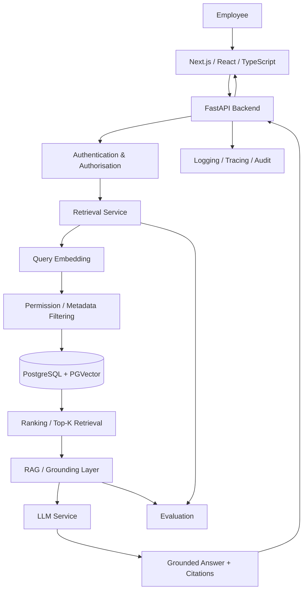

# Enterprise Knowledge Copilot

> A secure, source-grounded Generative AI platform for retrieving reliable answers from organisational knowledge.

**Status:** 🚧 Active Development  
**Current Phase:** Retrieval & RAG Foundation  
**Architecture:** Full-Stack GenAI / Retrieval-Augmented Generation (RAG)

---

## Overview

Enterprise Knowledge Copilot is a full-stack Generative AI application designed to help employees find reliable answers from an organisation's internal knowledge.

Organisations often store important information across employee handbooks, HR policies, IT procedures, security documentation, compliance guidance, operational manuals, and other internal resources.

Finding the correct information can be slow and difficult. Employees may search across multiple systems, rely on outdated documents, repeatedly ask colleagues the same questions, or use general-purpose AI systems that do not have access to the organisation's approved knowledge.

Enterprise Knowledge Copilot addresses this problem through a Retrieval-Augmented Generation (RAG) architecture.

Instead of relying only on an LLM's general knowledge, the system is designed to retrieve relevant information from authorised organisational documents and provide that evidence to the language model before an answer is generated.

The long-term product principle is simple:

> **Find → Ask → Verify**

Employees should be able to find organisational knowledge, ask questions naturally, and verify AI-generated answers against their original sources.

---

## Business Problem

Enterprise knowledge is frequently fragmented across documents, departments, and systems.

This creates several problems:

- employees spend time searching for information;
- the same questions are repeatedly answered by subject-matter experts;
- outdated policies may be used accidentally;
- general-purpose LLMs may generate plausible but incorrect organisational information;
- confidential information may require different access permissions;
- AI-generated answers may be difficult to audit without supporting evidence.

The project therefore focuses not simply on generating answers, but on building a knowledge system that is:

- **grounded** in approved organisational information;
- **traceable** through source citations;
- **permission-aware** by design;
- **measurable** through retrieval and generation evaluation;
- **observable** in production;
- **maintainable** through clear application architecture.

---

## Product Vision

The finished application is designed as a minimal enterprise knowledge workspace inspired by source-first research tools rather than a traditional chatbot dashboard.

The primary employee experience will focus on three actions:

1. **Find** relevant organisational knowledge.
2. **Ask** questions using natural language.
3. **Verify** answers through supporting sources.

Complex infrastructure, retrieval, security, evaluation, and observability should remain largely invisible to ordinary users.

---

## Example

An employee asks:

```text
Can I work from home?
```

The system should not simply send this question directly to an LLM.

Instead:

```text
User Question
      ↓
Authentication / Authorisation
      ↓
Query Embedding
      ↓
Permission-Aware Retrieval
      ↓
Relevant Document Chunks
      ↓
Ranking / Top-K Selection
      ↓
Grounded LLM Generation
      ↓
Answer + Source Citations
```

A response could therefore be presented as:

```text
Employees may work remotely for up to two days per week,
subject to approval from their line manager.

Source:
Remote Working Policy — Section 3.1
```

If sufficient supporting evidence cannot be retrieved, the application should avoid inventing an organisational policy and instead communicate that the available knowledge does not provide a reliable answer.

---

## Architecture

The target architecture separates the user interface, API, retrieval, generation, storage, security, evaluation, and operational concerns.



### Architectural Principle

The project follows separation of concerns.

For example, provider-specific LLM logic is isolated from FastAPI request/response handling. Retrieval logic is also being separated into its own service.

This reduces coupling and allows individual components to be tested, maintained, and replaced more easily.

---

## Enterprise Requirements

The target system is designed around real enterprise concerns rather than simply demonstrating an LLM API call.

### Knowledge Ingestion

Planned ingestion pipeline:

```text
Document
   ↓
Extraction
   ↓
Chunking
   ↓
Metadata
   ↓
Embedding
   ↓
Vector Index
```

Documents will retain metadata required for retrieval and citation, such as source, section, version, ownership, and access information where appropriate.

### Retrieval

The retrieval layer is designed to support:

- semantic search using embeddings;
- vector similarity;
- ranked retrieval;
- Top-K selection;
- metadata filtering;
- source metadata;
- relevance evaluation;
- insufficient-evidence handling.

### Grounded Generation

Retrieved organisational evidence is supplied to the LLM as context.

The model is instructed to generate responses using the available evidence rather than treating its general knowledge as the source of organisational truth.

### Source Citations

Answers are designed to expose their supporting evidence so users can verify important information against the underlying organisational document.

### Access Control

A core architectural requirement is that document permissions are applied **before confidential information is provided to the LLM**.

Target flow:

```text
Authenticated User
       ↓
Identity / Role
       ↓
Authorised Knowledge Scope
       ↓
Retrieval
       ↓
LLM Context
```

The objective is to prevent unauthorised document chunks from entering the generation context.

### Evaluation

The system will be evaluated rather than described using unsupported claims such as "highly accurate."

Planned evaluation areas include:

- expected-source retrieval;
- retrieval quality;
- groundedness / faithfulness;
- citation correctness;
- unsupported-question behaviour;
- permission-aware retrieval;
- latency;
- failure cases.

Measured results will be published only after experiments have been executed.

### Observability

The production design includes monitoring of relevant system behaviour such as:

- API errors;
- retrieval behaviour;
- LLM failures;
- latency;
- traces;
- model usage;
- audit events.

---

## Technology Stack

The architecture deliberately avoids adding technologies without a clear requirement.

| Layer | Technology | Purpose |
|---|---|---|
| Frontend | Next.js, React, TypeScript | Employee knowledge workspace |
| Backend | Python, FastAPI | API and application services |
| LLM | Gemini during development | Natural-language generation |
| Embeddings | Gemini Embedding | Semantic representation |
| Retrieval | Custom retrieval service | Retrieval logic and ranking |
| Database | PostgreSQL + PGVector | Persistent data and vector search |
| Validation | Pydantic | API request/response validation |
| Dependency Management | uv | Python environment and dependencies |
| Containers | Docker / Docker Compose | Reproducible environments |
| CI/CD | GitHub Actions | Automated validation and delivery |
| Observability | To be selected during implementation | Tracing, logging and evaluation |
| Deployment | Free-first deployment strategy | Portfolio demonstration |

Technologies such as LangChain, LangGraph, Kubernetes, Terraform, Qdrant, or additional databases will only be introduced when a project requirement justifies them.

---

## Current Implementation Status

The repository is under active development.

### Implemented

- [x] Python project environment using `uv`
- [x] FastAPI application foundation
- [x] Health endpoint
- [x] Question API endpoint foundation
- [x] Pydantic request validation
- [x] Environment-based secret configuration
- [x] Gemini connectivity
- [x] Dedicated LLM service
- [x] Initial embedding experiments
- [x] Cosine similarity implementation
- [x] Top-K retrieval experiment
- [x] Initial grounded-generation experiment

### In Progress

- [ ] Dedicated retrieval service
- [ ] Retrieval refactoring and testing
- [ ] RAG service architecture

### Planned

- [ ] Document ingestion
- [ ] Automatic chunking
- [ ] Document/source metadata
- [ ] PostgreSQL
- [ ] PGVector
- [ ] Persistent semantic retrieval
- [ ] Source citations
- [ ] Insufficient-evidence handling
- [ ] RAG evaluation suite
- [ ] Next.js / TypeScript frontend
- [ ] Authentication
- [ ] Role-based access control
- [ ] Permission-aware retrieval
- [ ] Docker / Docker Compose
- [ ] Automated testing
- [ ] GitHub Actions CI/CD
- [ ] Observability
- [ ] Deployment
- [ ] Production documentation

---

## Current RAG Learning Prototype

The current retrieval prototype demonstrates the fundamental retrieval sequence:

```text
Question
   ↓
Question Embedding
   ↓
Document Embeddings
   ↓
Cosine Similarity
   ↓
Ranking
   ↓
Top-K
   ↓
Retrieved Context
   ↓
Grounded Prompt
   ↓
LLM
   ↓
Answer
```

This implementation is intentionally being built from fundamental components before introducing higher-level orchestration frameworks.

The objective is to understand and defend the retrieval architecture rather than hide core behaviour behind abstractions prematurely.

---

## Security Principles

Security is treated as an architectural concern rather than a final UI feature.

The target design includes:

- secrets outside source control;
- authentication;
- role-based authorisation;
- retrieval-time permission enforcement;
- input validation;
- controlled document ingestion;
- auditability;
- prompt-injection considerations;
- prevention of confidential-context leakage;
- secure production secret management.

Real confidential organisational information will not be used with development services where the applicable data-handling terms are unsuitable.

Synthetic organisational documents are used during early development.

---

## Failure Scenarios

The project will deliberately test failure conditions rather than demonstrating only successful questions.

Examples include:

- question cannot be answered from available documents;
- irrelevant chunks rank highly;
- conflicting policy versions exist;
- user lacks permission for the most relevant document;
- malformed API request;
- LLM provider failure;
- database failure;
- retrieval failure;
- potentially malicious instructions within retrieved content.

These scenarios will inform the system's evaluation and defensive design.

---

## User Experience

The target UI follows a minimal source-first approach.

```text
┌───────────────────────────────────────────────────────────────┐
│                    Enterprise Knowledge Copilot               │
├─────────────────┬─────────────────────────────────────────────┤
│                 │                                             │
│ Sources         │              Ask your company               │
│                 │                                             │
│ Remote Working  │  "Can I work from home?"                   │
│ Annual Leave    │                                             │
│ IT Security     │  Employees may work remotely for up to     │
│                 │  two days per week...                       │
│ + Add Source    │                                             │
│                 │  Source: Remote Working Policy §3.1         │
│                 │                                             │
│                 │  Ask about company knowledge...             │
└─────────────────┴─────────────────────────────────────────────┘
```

The interface should remain simple even as the engineering underneath it becomes more sophisticated.

---

## Repository Structure

The repository will evolve toward the following structure as components are implemented:

```text
enterprise-knowledge-copilot/
│
├── frontend/
│
├── backend/
│   └── app/
│       ├── api/
│       ├── data/
│       ├── models/
│       ├── services/
│       │   ├── llm_service.py
│       │   ├── retrieval_service.py
│       │   └── rag_service.py
│       └── main.py
│
├── docs/
│   ├── architecture.md
│   ├── api_design.md
│   ├── business_problem.md
│   ├── data_model.md
│   ├── deployment.md
│   ├── evaluation.md
│   ├── observability.md
│   ├── product_requirements.md
│   ├── rag_design.md
│   ├── roadmap.md
│   ├── security.md
│   ├── technology_decisions.md
│   ├── testing_strategy.md
│   └── ui_ux.md
│
├── evaluations/
├── tests/
├── .github/
│   └── workflows/
│
├── docker-compose.yml
├── pyproject.toml
├── uv.lock
└── README.md
```

Directories shown above may not yet exist while their associated milestones remain planned.

---

## Engineering Principles

This project follows several rules:

### 1. No technology without a requirement

A tool is introduced because it solves a problem, not because it is popular.

### 2. No unsupported claims

Performance, security, accuracy, and reliability claims require implementation and evidence.

### 3. Security before generation

Unauthorised information should not be exposed to the LLM context.

### 4. Evaluation before confidence

Retrieval and generation quality must be measured.

### 5. Simple UX, serious engineering

The employee experience should remain easy to understand while the backend handles retrieval, permissions, grounding, evaluation, and operational concerns.

### 6. Build what can be defended

Every significant architectural choice should have a clear rationale and trade-off.

---

## Development Roadmap

The active portfolio sprint is organised around the following milestones:

| Day | Milestone |
|---|---|
| 1 | Production Retrieval Engine |
| 2 | Document Ingestion & Chunking |
| 3 | PostgreSQL + PGVector |
| 4 | Production RAG + Citations |
| 5 | FastAPI Architecture |
| 6 | RAG Evaluation |
| 7 | Next.js / TypeScript UI |
| 8 | Full-Stack Integration |
| 9 | Authentication & Permission-Aware Retrieval |
| 10 | Docker & Docker Compose |
| 11 | Testing & CI/CD |
| 12 | Observability |
| 13 | Deployment |
| 14 | Portfolio Release |

Detailed implementation status will be maintained in the project documentation.

---

## Project Goal

The goal is not to create another "chat with PDF" demonstration.

The goal is to engineer and document a credible enterprise GenAI system that demonstrates:

- full-stack application development;
- LLM integration;
- Retrieval-Augmented Generation;
- semantic retrieval;
- vector search;
- secure architecture;
- evaluation;
- observability;
- testing;
- deployment;
- engineering trade-offs.

The finished repository should provide both a usable application and clear evidence of the engineering decisions behind it.

---

## Author

**Hammed Fatai**

MSc Computer Science & Artificial Intelligence  
AI / Generative AI Engineering Portfolio Project
