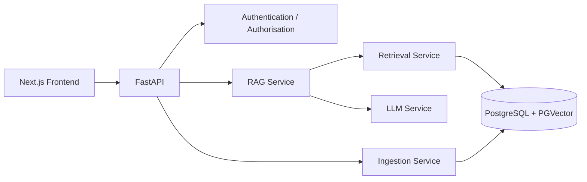
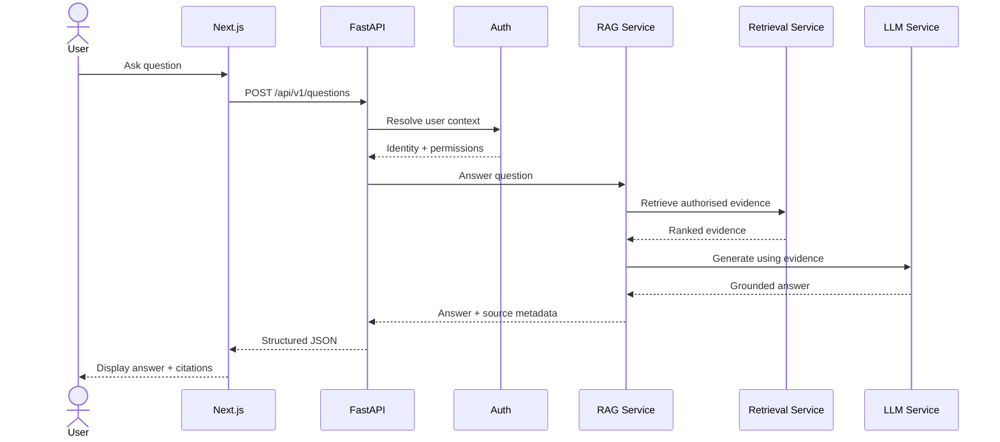
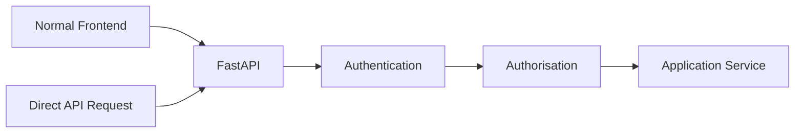

# API Design

**Project:** Enterprise Knowledge Copilot  
**Document Type:** Backend API Specification  
**Status:** Approved Target Design  
**Implementation Status:** 🚧 Active Development  
**Framework:** FastAPI  
**Data Validation:** Pydantic

---

# 1. Purpose

This document defines the target API design for Enterprise Knowledge Copilot.

The API connects the frontend to application services responsible for:

- authentication context;
- organisational questions;
- RAG;
- retrieval;
- citations;
- document management;
- feedback;
- health monitoring.

The API should provide stable application contracts without exposing unnecessary implementation details.

The central principle is:

> **Thin API endpoints, explicit application services, structured responses.**

---

# 2. API Architecture



FastAPI acts as the external backend interface.

Business logic should remain inside application services rather than accumulating inside endpoint functions.

---

# 3. API Responsibilities

The API layer is responsible for:

```text
Receive Request
      ↓
Validate Input
      ↓
Resolve Authentication Context
      ↓
Check Required Authorisation
      ↓
Invoke Application Service
      ↓
Map Application Result
      ↓
Return Structured HTTP Response
```

The API layer should not directly implement:

- vector mathematics;
- document chunking;
- provider-specific LLM logic;
- complex database queries;
- RAG orchestration.

---

# 4. API Versioning

The current prototype may continue using simple routes while the architecture is being developed.

The target production-facing API should support explicit versioning.

Target prefix:

```text
/api/v1
```

Example:

```text
POST /api/v1/questions
```

Versioning provides a controlled path for future API changes.

---

# 5. Core Endpoint Groups

The target API is organised around:

```text
/health
/questions
/documents
/sources
/conversations
/feedback
```

Administrative endpoints should be introduced only when corresponding product requirements are implemented.

---

# 6. Health Endpoint

## Endpoint

```http
GET /health
```

## Purpose

Provides basic application liveness information.

## Current Conceptual Response

```json
{
  "status": "healthy"
}
```

## Important Distinction

A basic health endpoint confirms that the FastAPI application can respond.

It does not automatically prove that:

- PostgreSQL is available;
- the embedding provider is available;
- the LLM provider is available;
- vector retrieval works.

Dependency readiness should be represented separately if implemented.

---

# 7. Readiness Endpoint

A future deployment may introduce:

```http
GET /ready
```

or:

```http
GET /api/v1/ready
```

Its purpose would be to determine whether required dependencies are ready to serve application requests.

Conceptually:

```json
{
  "status": "ready",
  "dependencies": {
    "database": "available"
  }
}
```

External AI-provider health should not necessarily be probed on every readiness request if doing so creates unnecessary cost or dependency traffic.

---

# 8. Question Endpoint

The central RAG endpoint is:

```http
POST /api/v1/questions
```

During early development the existing route may remain:

```http
POST /questions
```

until API versioning is introduced deliberately.

---

# 9. Question Request

Conceptual request:

```json
{
  "question": "Can I work from home?"
}
```

Target Pydantic concept:

```python
class QuestionRequest(BaseModel):
    question: str
```

Additional fields should not be added without a requirement.

---

# 10. Question Validation

The API should reject invalid requests.

Examples include:

```json
{}
```

or:

```json
{
  "question": ""
}
```

or an inappropriate data type.

Validation rules may eventually include:

- required question;
- minimum meaningful length;
- maximum allowed length;
- whitespace handling.

FastAPI/Pydantic validation provides the schema boundary, while additional application validation may enforce business rules.

---

# 11. Question Processing Flow



---

# 12. Target Question Response

Conceptually:

```json
{
  "answer": "Employees may work remotely for up to two days per week, subject to approval from their line manager.",
  "status": "answered",
  "sources": [
    {
      "title": "Remote Working Policy",
      "section": "3.1",
      "page": 4,
      "version": "2.0"
    }
  ]
}
```

This represents the target contract.

Fields should only be populated from actual application evidence.

---

# 13. Insufficient-Evidence Response

If organisational evidence is insufficient:

```json
{
  "answer": "I cannot find this information in the available company policies.",
  "status": "insufficient_evidence",
  "sources": []
}
```

The application should distinguish this state from:

```text
LLM Provider Failure
```

or:

```text
Database Failure
```

Insufficient evidence is a valid RAG outcome, not necessarily a system error.

---

# 14. Source Model

Conceptual source schema:

```python
class SourceResponse(BaseModel):
    title: str
    section: str | None = None
    page: int | None = None
    version: str | None = None
```

Source metadata should originate from retrieval/database records rather than being invented by the LLM.

---

# 15. Internal Retrieval Model

The internal retrieval service requires more information than the frontend.

Conceptually:

```python
class RetrievedChunk:
    chunk_id: str
    document_id: str
    content: str
    score: float
    title: str
    section: str | None
    page: int | None
    version: str | None
```

Internal retrieval scores do not necessarily need to be exposed to end users.

---

# 16. Why Hide Retrieval Scores From Normal Users?

A similarity score is a technical retrieval signal.

A value such as:

```text
0.82
```

does not automatically mean:

```text
82% correct
```

Displaying it as a user confidence percentage could therefore be misleading.

Retrieval scores are more appropriate for:

- evaluation;
- debugging;
- observability;
- engineering analysis.

---

# 17. Documents Endpoint

Target endpoint:

```http
POST /api/v1/documents
```

Purpose:

> Ingest an authorised organisational document.

This endpoint should require authentication and appropriate document-management permission.

---

# 18. Document Upload Flow

```text
Upload Request
      ↓
Authentication
      ↓
Authorisation
      ↓
File Validation
      ↓
Ingestion Service
      ↓
Extraction
      ↓
Chunking
      ↓
Embedding
      ↓
Persistence
```

The endpoint should not contain the implementation for all these stages itself.

---

# 19. Document Upload Request

The final request may use:

```text
multipart/form-data
```

because binary files may be uploaded.

Associated metadata could include:

```text
title
department
version
access_scope
effective_date
```

The final fields will align with the implemented data model.

---

# 20. Document Upload Response

Conceptually:

```json
{
  "document_id": "doc-001",
  "title": "Remote Working Policy",
  "status": "processed"
}
```

If ingestion later becomes asynchronous, the response may instead represent:

```text
accepted
processing
completed
failed
```

No asynchronous infrastructure should be introduced before the requirement exists.

---

# 21. List Documents

Target:

```http
GET /api/v1/documents
```

Purpose:

Return documents visible to the authenticated user or knowledge administrator according to access rules.

The API must not rely on the frontend to hide restricted documents.

---

# 22. Retrieve Document

Target:

```http
GET /api/v1/documents/{document_id}
```

Purpose:

Return permitted document metadata.

The backend must verify access to the requested document.

Changing:

```text
document_id
```

must not allow a user to bypass authorisation.

---

# 23. Document Source Content

A source-inspection capability may use:

```http
GET /api/v1/documents/{document_id}/content
```

or a more targeted source endpoint.

The final implementation should avoid unnecessarily returning an entire document when only a cited section is required.

---

# 24. Conversations

Target endpoints may include:

```http
POST /api/v1/conversations
GET  /api/v1/conversations
GET  /api/v1/conversations/{conversation_id}
```

Conversation persistence should only be implemented with appropriate ownership and retention rules.

A user must not gain access to another user's conversation by changing an identifier.

---

# 25. Questions Within Conversations

A future request may include:

```json
{
  "question": "Can I work from home?",
  "conversation_id": "conv-001"
}
```

Conversation support should not complicate the initial RAG implementation unnecessarily.

The first working RAG endpoint can remain stateless before conversation persistence is introduced.

---

# 26. Feedback Endpoint

Target:

```http
POST /api/v1/messages/{message_id}/feedback
```

Conceptual request:

```json
{
  "rating": "helpful"
}
```

or:

```json
{
  "rating": "not_helpful",
  "comment": "The cited policy did not answer my question."
}
```

Feedback is a product signal rather than an automatic ground-truth evaluation label.

---

# 27. Authentication Context

Protected API requests should resolve an authenticated user.

Conceptually:

```text
Request
   ↓
Authentication Token / Session
   ↓
Authentication Layer
   ↓
User Identity
   ↓
Roles / Permissions
```

Application services should receive explicit user/access context where required.

---

# 28. Authorisation Context

Retrieval should not receive only:

```text
question
```

It eventually needs something conceptually similar to:

```text
question
+
authorised knowledge scope
```

For example:

```python
retrieve(
    question=question,
    access_scope=user_context.access_scope,
)
```

This is conceptual rather than final code.

---

# 29. Error Response Design

Errors should be structured and predictable.

Conceptual format:

```json
{
  "error": {
    "code": "DOCUMENT_ACCESS_DENIED",
    "message": "You do not have permission to access this resource."
  }
}
```

The API should not expose:

- stack traces;
- database credentials;
- provider keys;
- internal connection information.

---

# 30. HTTP Status Codes

Target usage:

| Status | Meaning |
|---|---|
| `200` | Successful request |
| `201` | Resource created |
| `202` | Accepted for asynchronous processing, if used |
| `400` | Invalid application request |
| `401` | Authentication required/invalid |
| `403` | Authenticated but not permitted |
| `404` | Resource not found or safely undisclosed |
| `409` | Resource conflict where applicable |
| `413` | Request/file too large where enforced |
| `422` | Request schema validation failure |
| `429` | Rate limit exceeded if implemented |
| `500` | Unexpected internal failure |
| `503` | Required service temporarily unavailable |

Status selection should match actual endpoint behaviour.

---

# 31. 401 vs 403

These should not be confused.

```text
401 Unauthorized
```

typically means:

> The request does not have valid authentication.

```text
403 Forbidden
```

means:

> The user is authenticated but does not have permission for the requested action.

This distinction matters for API design and debugging.

---

# 32. Validation Errors

FastAPI/Pydantic can automatically return validation errors when a request does not satisfy its schema.

Example:

```json
{
  "question": 123
}
```

may violate the expected request contract depending on the implemented schema/configuration.

Validation should occur before invalid data reaches core application services.

---

# 33. Provider Failure

Suppose the external LLM provider is unavailable.

The system should not return:

```text
500
google.genai.errors...
API_KEY...
internal stack trace...
```

Instead, provider-specific exceptions should be translated through application boundaries.

Conceptually:

```text
Provider Error
     ↓
LLM Service
     ↓
Application Error
     ↓
API Error Handler
     ↓
Safe HTTP Response
```

---

# 34. Database Failure

If PostgreSQL becomes unavailable:

```text
Request
  ↓
Retrieval
  ↓
Database Failure
```

the application should return controlled failure behaviour.

It must not generate an organisational answer without evidence merely because retrieval failed.

This distinction is critical:

```text
No evidence exists
```

is different from:

```text
Evidence system unavailable
```

---

# 35. Request IDs

Production-oriented requests should eventually have a request/correlation identifier.

Conceptually:

```text
request_id = req-123
```

This identifier can connect:

```text
API Request
   ↓
Retrieval Trace
   ↓
LLM Call
   ↓
Error / Response
```

without requiring sensitive content to be logged everywhere.

---

# 36. CORS

The frontend and backend may run on different origins during development or deployment.

FastAPI may therefore require CORS configuration.

CORS should explicitly permit required frontend origins.

Avoid treating:

```text
allow_origins=["*"]
```

as the default production security configuration.

---

# 37. API Documentation

FastAPI automatically provides OpenAPI-based interactive documentation.

During development this supports:

- endpoint exploration;
- request testing;
- schema inspection.

The generated documentation is useful but does not replace architectural documentation explaining why endpoints exist.

---

# 38. API Schema Design

Pydantic schemas should distinguish between:

```text
Request Models
Response Models
Internal Domain / Service Models
Database Models
```

These concepts may overlap initially but should not become permanently coupled without reason.

---

# 39. Example Target Schemas

Conceptually:

```python
class QuestionRequest(BaseModel):
    question: str


class SourceResponse(BaseModel):
    title: str
    section: str | None = None
    page: int | None = None
    version: str | None = None


class QuestionResponse(BaseModel):
    answer: str
    status: str
    sources: list[SourceResponse]
```

This is a design example.

The final code should be introduced step-by-step and tested.

---

# 40. API Security Boundary

The backend must enforce security even if someone completely bypasses the frontend.



Security must therefore exist at the backend boundary.

---

# 41. API and RAG Separation

Avoid:

```python
@app.post("/questions")
def ask_question(...):
    # authenticate
    # query database
    # calculate vectors
    # rank chunks
    # build prompt
    # call Gemini
    # create citations
    # log everything
```

Target direction:

```text
Question Endpoint
       ↓
RAG Service
       ├── Retrieval Service
       └── LLM Service
```

The endpoint coordinates HTTP concerns.

The services implement application behaviour.

---

# 42. Current API Status

## Implemented Foundation

The current backend has demonstrated:

```text
GET /health
POST /questions
Pydantic request validation
LLM Service integration
Gemini generation
```

The existing question endpoint is still part of the development foundation.

---

## In Progress / Planned

```text
Retrieval integration
RAG service
Structured citations
Versioned API
Authentication
Authorisation
Document endpoints
Conversation endpoints
Feedback
Structured error handling
Request tracing
Production CORS
Rate limiting where justified
```

These features should not be represented as implemented until verified.

---

# 43. Target Initial API Surface

The initial enterprise portfolio release is expected to evolve toward:

```text
System
GET    /health

Questions
POST   /api/v1/questions

Documents
POST   /api/v1/documents
GET    /api/v1/documents
GET    /api/v1/documents/{document_id}

Conversations
POST   /api/v1/conversations
GET    /api/v1/conversations
GET    /api/v1/conversations/{conversation_id}

Feedback
POST   /api/v1/messages/{message_id}/feedback
```

Additional endpoints should be introduced only when required.

---

# 44. Endpoint Design Rules

Every endpoint should answer:

```text
What business capability does this expose?

Who is allowed to call it?

What input does it accept?

What does it return?

What happens when validation fails?

What happens when a dependency fails?

What should be logged?

How will it be tested?
```

---

# 45. API Definition of Done

The API layer is ready for the initial portfolio release when:

- endpoints have explicit request/response schemas;
- authentication protects required routes;
- authorisation is enforced server-side;
- questions flow through RAG rather than directly to the LLM;
- citations are returned from trusted metadata;
- validation errors are controlled;
- provider/database failures are handled;
- API tests exist;
- OpenAPI documentation reflects the implementation;
- secrets/internal errors are not exposed;
- frontend integration works.

---

# 46. API North Star

The API should remain:

```text
Simple externally
       ↓
Structured internally
       ↓
Secure at the boundary
       ↓
Thin at the endpoint
       ↓
Explicit in its contracts
```

For a question request:

```text
POST /questions
       ↓
Validate
       ↓
Authenticate
       ↓
Authorise
       ↓
RAG Service
       ↓
Permission-Aware Retrieval
       ↓
Grounded Generation
       ↓
Answer + Citations
```

The endpoint itself should remain easy to understand because the complexity belongs in well-defined application services.
