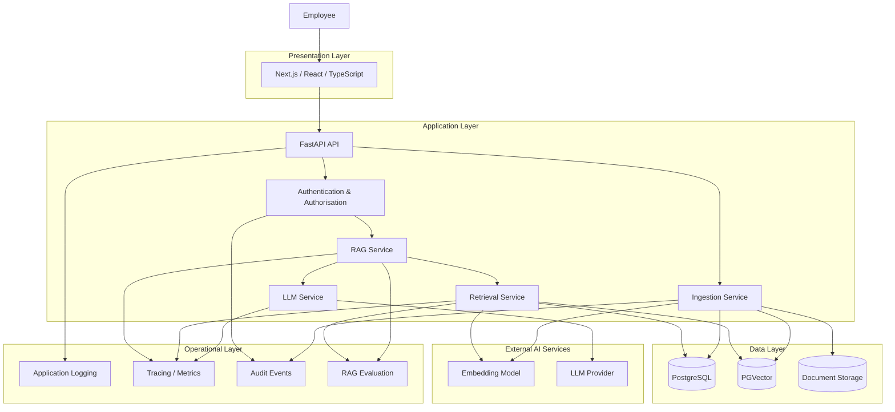
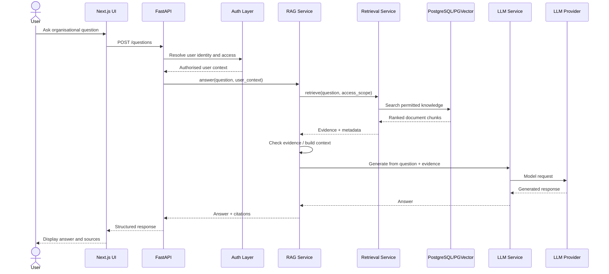
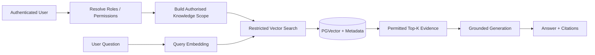
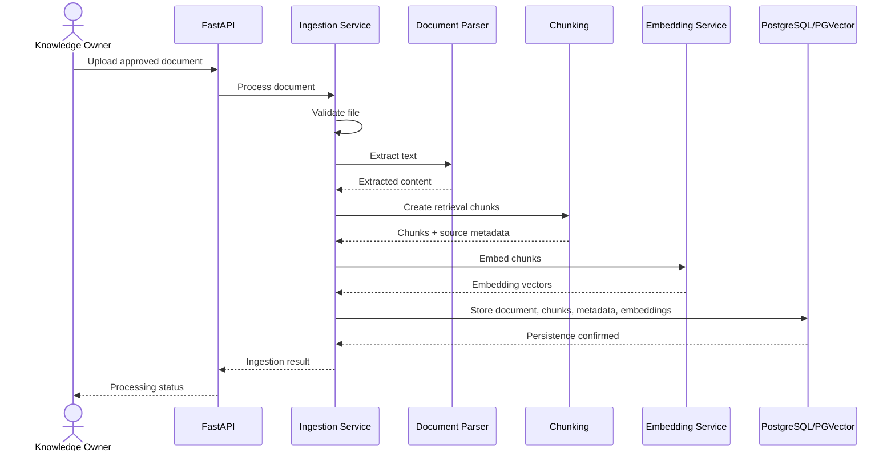
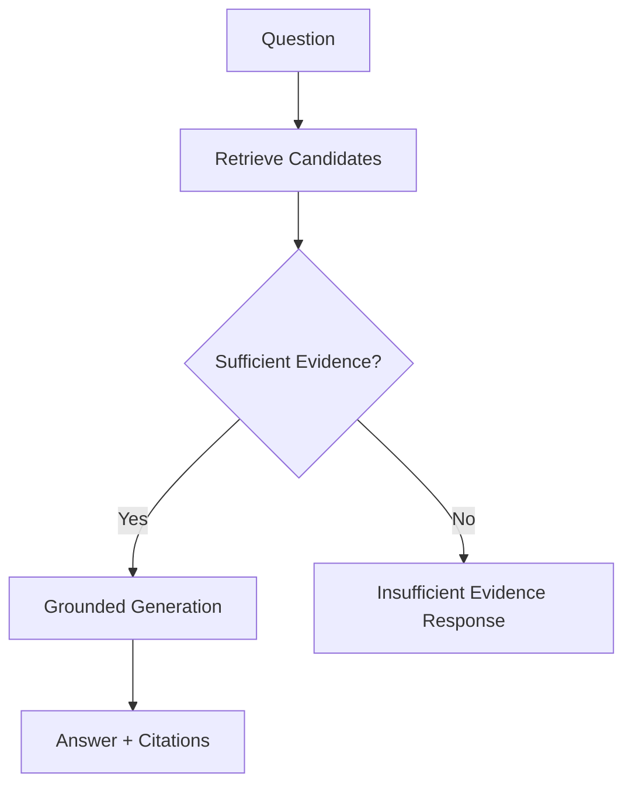
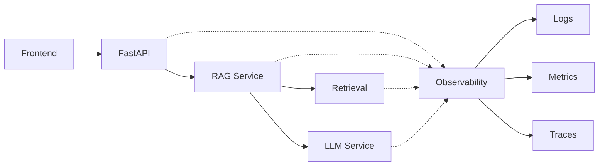

# System Architecture

**Project:** Enterprise Knowledge Copilot  
**Document Type:** Technical Architecture Specification  
**Status:** Approved Target Architecture  
**Implementation Status:** 🚧 Active Development  
**Architecture Style:** Modular Full-Stack Application / RAG System

---

# 1. Purpose

This document defines the target technical architecture for Enterprise Knowledge Copilot.

The architecture is designed around six primary concerns:

1. reliable access to organisational knowledge;
2. grounded Generative AI responses;
3. permission-aware retrieval;
4. source traceability;
5. maintainable software boundaries;
6. measurable and observable system behaviour.

The architecture deliberately avoids unnecessary complexity.

The objective is not to maximise the number of technologies in the system.

The objective is to create:

> **A simple user experience supported by defensible enterprise engineering.**

---

# 2. Architecture Principles

The system follows the following principles.

## 2.1 Separation of Concerns

Different responsibilities should remain separated.

For example:

```text
API request handling
        ≠
retrieval logic
        ≠
LLM provider logic
        ≠
database logic
```

This improves:

- maintainability;
- testability;
- provider independence;
- debugging;
- future scalability.

---

## 2.2 Security Before Generation

The LLM must not be treated as the security boundary.

The intended sequence is:

```text
User
 ↓
Authentication
 ↓
Authorisation
 ↓
Permitted Retrieval Scope
 ↓
Retrieval
 ↓
LLM Context
```

Restricted information should therefore be filtered before it reaches the generation layer.

---

## 2.3 Retrieval Before Generation

For organisational questions, the system should retrieve relevant approved evidence before asking the LLM to generate an answer.

```text
Retrieve
   ↓
Ground
   ↓
Generate
```

The LLM is responsible for generating language.

It is not automatically the authoritative source of organisational policy.

---

## 2.4 Evidence Before Confidence

The application should not claim that an answer is reliable simply because an LLM generated it.

Where applicable, answers should expose supporting organisational evidence.

---

## 2.5 Measure Before Optimising

Retrieval quality, latency, citation correctness, and generation behaviour should be measured before optimisation decisions are made.

---

## 2.6 Build Before Scaling

The initial system will use a modular application architecture.

Microservices, Kubernetes, distributed queues, or additional infrastructure should only be introduced when a demonstrated requirement justifies them.

---

# 3. High-Level Architecture



The diagram represents the target architecture.

Not every component is currently implemented.

---

# 4. Architecture Layers

The application is divided conceptually into several layers.

```text
┌─────────────────────────────────────┐
│         Presentation Layer          │
│     Next.js / React / TypeScript    │
├─────────────────────────────────────┤
│             API Layer               │
│              FastAPI                │
├─────────────────────────────────────┤
│        Application Services         │
│                                     │
│ Auth │ RAG │ Retrieval │ Ingestion │
│              LLM                    │
├─────────────────────────────────────┤
│              Data Layer             │
│       PostgreSQL + PGVector         │
├─────────────────────────────────────┤
│          External Services          │
│       Embeddings │ LLM Provider     │
├─────────────────────────────────────┤
│         Operational Concerns        │
│ Logs │ Traces │ Audit │ Evaluation │
└─────────────────────────────────────┘
```

---

# 5. Presentation Layer

## Technology Direction

```text
Next.js
React
TypeScript
```

The presentation layer provides the employee-facing knowledge workspace.

Its responsibilities include:

- displaying available knowledge sources;
- accepting user questions;
- displaying generated answers;
- displaying citations;
- allowing users to inspect supporting sources;
- representing loading and failure states;
- handling authentication-related user flows.

The frontend should not implement retrieval or LLM business logic.

---

# 6. API Layer

## Technology

```text
FastAPI
Pydantic
```

FastAPI acts as the primary backend interface.

Its responsibilities include:

- accepting HTTP requests;
- validating request data;
- resolving authenticated user context;
- invoking application services;
- returning structured responses;
- translating controlled application failures into appropriate HTTP responses.

The API layer should remain relatively thin.

It should not contain large amounts of retrieval, database, or provider-specific LLM logic.

---

# 7. Application Services

Application services contain the core business behaviour.

The target services include:

```text
Authentication / Authorisation
Retrieval Service
RAG Service
LLM Service
Ingestion Service
```

Additional services should only be introduced when responsibilities justify them.

---

# 8. LLM Service

## Responsibility

The LLM Service isolates model-provider interaction from the rest of the application.

Current development provider:

```text
Gemini
```

Conceptual interface:

```text
Application
    ↓
LLM Service
    ↓
Provider SDK/API
    ↓
Language Model
```

The FastAPI endpoint should not need to understand provider-specific response objects.

The service should eventually be responsible for concerns such as:

- generation requests;
- provider configuration;
- controlled errors;
- timeouts;
- potentially retries where appropriate;
- model configuration;
- response extraction.

This separation reduces provider coupling.

A future provider change should not require provider-specific logic to be rewritten throughout the API layer.

---

# 9. Retrieval Service

## Responsibility

The Retrieval Service is responsible for finding relevant organisational evidence.

Target sequence:

```text
Question
   ↓
Query Embedding
   ↓
Permission / Metadata Constraints
   ↓
Vector Search
   ↓
Ranking
   ↓
Top-K
   ↓
Retrieved Evidence
```

The Retrieval Service should return structured evidence rather than only raw strings.

Conceptually:

```json
{
  "chunk_id": "chunk-123",
  "content": "Employees may work remotely...",
  "score": 0.84,
  "document": "Remote Working Policy",
  "section": "3.1",
  "version": "2.0"
}
```

The similarity value above is illustrative only and is not a claimed project result.

---

# 10. RAG Service

The RAG Service coordinates retrieval and generation.

It represents the application workflow rather than a model provider.

Conceptually:

```text
Question
   ↓
Retrieval Service
   ↓
Evidence
   ↓
Evidence Validation
   ↓
Prompt / Context Construction
   ↓
LLM Service
   ↓
Answer
   ↓
Attach Source Metadata
   ↓
Structured RAG Response
```

The RAG Service should not independently implement vector mathematics or provider-specific SDK calls.

Those responsibilities belong to the appropriate lower-level services.

---

# 11. Ingestion Service

The Ingestion Service is responsible for transforming organisational documents into searchable knowledge.

Target pipeline:

```text
Document
   ↓
Validation
   ↓
Text Extraction
   ↓
Chunking
   ↓
Metadata Creation
   ↓
Embedding
   ↓
Persistent Storage
```

The ingestion process should preserve enough metadata to support:

- citations;
- document ownership;
- versioning;
- access control;
- lifecycle state;
- retrieval filtering.

---

# 12. Data Architecture

The target persistent database is:

```text
PostgreSQL + PGVector
```

PostgreSQL handles relational application data.

PGVector adds vector storage and similarity-search capabilities.

This allows the project to keep relational metadata and vector retrieval within a single database technology during the initial release.

Conceptually:

```text
PostgreSQL
│
├── users
├── roles
├── user_roles
├── documents
├── document_permissions
├── document_chunks
├── conversations
├── feedback
└── audit_events

PGVector
│
└── document_chunks.embedding
```

The final schema will be defined in `data_model.md`.

---

# 13. Why PostgreSQL + PGVector

The initial architecture does not require a separate specialist vector database.

PostgreSQL already provides:

- relational data modelling;
- transactions;
- mature indexing;
- access to structured metadata;
- established operational tooling.

PGVector adds vector search while allowing document metadata and embeddings to remain closely associated.

This gives the project a simpler initial architecture.

A dedicated vector database may be considered later if measured requirements justify it.

Possible future reasons could include:

- retrieval scale;
- operational separation;
- specialist indexing requirements;
- measured performance limitations.

The architecture should not introduce an additional vector database merely for technology visibility.

---

# 14. Question Request Flow

The following sequence describes the target end-to-end question flow.



---

# 15. Critical Security Boundary

One of the most important architecture decisions is the location of authorisation.

Consider the following documents:

```text
General Employee Handbook
Remote Working Policy
Finance Forecast
Executive Compensation Report
```

Suppose an ordinary employee asks a question semantically similar to information in the Executive Compensation Report.

An unsafe architecture could do this:

```text
Search ALL documents
       ↓
Retrieve Executive Document
       ↓
Send to LLM
       ↓
Ask LLM not to reveal it
```

This design places too much trust in the model.

The target architecture instead follows:

```text
Authenticated User
       ↓
Determine Access Scope
       ↓
Restrict Searchable Knowledge
       ↓
Retrieve ONLY Permitted Evidence
       ↓
Send Permitted Evidence to LLM
```

The key principle is:

> **Unauthorised content should not enter the generation context.**

---

# 16. Permission-Aware Retrieval Flow



Permission enforcement must ultimately exist in implementation and tests before the project claims this behaviour is secure.

---

# 17. Document Ingestion Flow



---

# 18. Document Lifecycle

Documents may change over time.

The architecture should support lifecycle metadata such as:

```text
draft
active
superseded
archived
```

Example:

```text
Remote Working Policy v1
        ↓
     superseded

Remote Working Policy v2
        ↓
       active
```

Retrieval should eventually use lifecycle metadata to prevent obsolete documents from being treated as current organisational truth.

---

# 19. Citation Architecture

Citations should originate from retrieval metadata rather than being invented by the LLM.

Target relationship:

```text
Document
   ↓
Chunk
   ↓
Metadata
   ↓
Retrieved Evidence
   ↓
LLM Context
   ↓
Answer
   +
Citation from Retrieval Metadata
```

Example response structure:

```json
{
  "answer": "Employees may work remotely for up to two days per week.",
  "sources": [
    {
      "document_id": "doc-001",
      "title": "Remote Working Policy",
      "section": "3.1",
      "version": "2.0"
    }
  ]
}
```

This structure is conceptual until the final API model is implemented.

---

# 20. Insufficient-Evidence Architecture

Top-K retrieval alone is not enough.

A retrieval system can return the closest available documents even when none properly answers the question.

Target decision flow:



The exact evidence policy should be informed by evaluation.

A universal cosine-similarity threshold should not be assumed without evidence.

---

# 21. External Provider Boundary

External AI providers are treated as dependencies.

```text
Enterprise Knowledge Copilot
          ↓
      LLM Service
          ↓
    Provider Boundary
          ↓
    Gemini / Future Model
```

Provider-specific code should remain isolated where practical.

This supports:

- easier testing;
- controlled provider changes;
- clearer failure handling;
- reduced application coupling.

---

# 22. Failure Architecture

External systems fail.

The architecture must therefore consider:

```text
Embedding Provider Failure
LLM Provider Failure
Database Failure
Document Parsing Failure
Authentication Failure
Authorisation Failure
Timeout
Invalid Request
Insufficient Evidence
```

Failures should eventually be converted into controlled application behaviour rather than raw provider exceptions reaching the user.

Example conceptual flow:

```text
Provider Error
     ↓
Service Layer
     ↓
Controlled Application Error
     ↓
API Error Mapping
     ↓
Safe User Response
     +
Operational Log
```

---

# 23. Observability Architecture

Observability crosses application boundaries.



Target observations may include:

- request ID;
- endpoint;
- response status;
- total latency;
- retrieval latency;
- generation latency;
- number of retrieved chunks;
- source identifiers;
- model/provider;
- controlled errors.

Sensitive organisational content should not be indiscriminately logged.

---

# 24. Evaluation Architecture

Evaluation is separate from normal application execution but uses the same core services where practical.

```text
Evaluation Dataset
       ↓
Known Question
       ↓
Application Retrieval
       ↓
Retrieved Sources
       ↓
Compare with Expected Sources
       ↓
Generation
       ↓
Evaluate Grounding / Citation Behaviour
       ↓
Store Results
```

This allows architectural decisions to be based on evidence.

For example:

```text
Chunk size A vs Chunk size B
Top-1 vs Top-3
Retrieval strategy A vs B
```

should eventually be compared using repeatable evaluation rather than intuition alone.

---

# 25. Deployment Architecture

The initial deployment target remains intentionally simple.

Conceptually:

```text
Browser
   ↓
Frontend
   ↓
FastAPI
   ↓
PostgreSQL + PGVector
   ↓
External AI Provider
```

Containers will provide reproducible execution.

```text
Docker Compose
│
├── frontend
├── backend
└── postgres/pgvector
```

Production hosting may separate these components depending on the selected platform.

---

# 26. Why a Modular Monolith First

The initial backend will be implemented as a modular monolith.

Conceptually:

```text
FastAPI Application
│
├── API
├── Authentication
├── RAG
├── Retrieval
├── Ingestion
├── LLM
└── Data Access
```

These components are logically separated but can initially run within the same backend application.

This is intentional.

Benefits include:

- lower operational complexity;
- simpler local development;
- easier debugging;
- simpler transactions;
- faster portfolio development;
- clear module boundaries without distributed-system overhead.

---

# 27. Why Not Microservices Yet?

A microservice architecture could introduce:

```text
API Gateway
Authentication Service
Retrieval Service
Ingestion Service
Generation Service
Document Service
Audit Service
Message Broker
Service Discovery
Distributed Tracing
Network Failure Handling
```

That architecture may be appropriate at sufficient organisational or scaling complexity.

However, implementing it before those requirements exist would add operational complexity without demonstrating proportional business value.

The project therefore follows:

> **Modular boundaries first. Distributed boundaries when justified.**

---

# 28. Scaling Strategy

The architecture should allow future evolution without pretending that scale problems already exist.

Potential future progression:

```text
Stage 1
Modular Monolith
       ↓
Stage 2
Scale Stateless Backend Horizontally
       ↓
Stage 3
Optimise Database / Vector Indexing
       ↓
Stage 4
Separate Expensive Background Work
       ↓
Stage 5
Extract Services Where Operationally Justified
```

Possible future requirements could include:

- large document volumes;
- heavy ingestion workloads;
- large concurrent user populations;
- independent deployment requirements;
- specialised retrieval infrastructure;
- geographic availability requirements.

Scaling decisions should follow measured constraints.

---

# 29. Background Processing

Document ingestion may eventually become expensive enough to justify asynchronous/background processing.

For example:

```text
Upload
  ↓
Accept Document
  ↓
Queue Processing Job
  ↓
Extract
  ↓
Chunk
  ↓
Embed
  ↓
Index
  ↓
Mark Ready
```

A queue should not be introduced until asynchronous processing provides a clear benefit.

The initial implementation may process small synthetic documents synchronously while the architecture remains capable of evolving.

---

# 30. Repository Architecture

The repository is expected to evolve toward:

```text
enterprise-knowledge-copilot/
│
├── frontend/
│   ├── app/
│   ├── components/
│   ├── lib/
│   └── types/
│
├── backend/
│   └── app/
│       ├── api/
│       ├── core/
│       ├── models/
│       ├── schemas/
│       ├── services/
│       │   ├── ingestion_service.py
│       │   ├── llm_service.py
│       │   ├── rag_service.py
│       │   └── retrieval_service.py
│       ├── repositories/
│       └── main.py
│
├── tests/
├── evaluations/
├── docs/
├── .github/
│   └── workflows/
│
├── docker-compose.yml
├── pyproject.toml
└── README.md
```

This is a target structure.

Directories should be created as implementation requires them rather than as empty architecture theatre.

---

# 31. Current Architecture Status

## Implemented / Prototyped

```text
FastAPI
   ↓
Question Endpoint
   ↓
LLM Service
   ↓
Gemini
```

Retrieval concepts already prototyped include:

```text
Question
   ↓
Embedding
   ↓
Cosine Similarity
   ↓
Ranking
   ↓
Top-K
   ↓
Retrieved Context
   ↓
Grounded Generation
```

---

## In Progress

```text
Retrieval Service
```

The experimental retrieval implementation is being refactored into a reusable application service.

---

## Planned

```text
Document Ingestion
        ↓
PostgreSQL + PGVector
        ↓
Persistent Retrieval
        ↓
RAG Service
        ↓
Citations
        ↓
Evaluation
        ↓
Frontend
        ↓
Authentication / RBAC
        ↓
Permission-Aware Retrieval
        ↓
Containers
        ↓
CI/CD
        ↓
Observability
        ↓
Deployment
```

---

# 32. Architecture Decision Rules

Before introducing a new technology, the project must answer:

```text
1. What problem are we solving?

2. Why does the current architecture not solve it adequately?

3. What does the proposed technology provide?

4. What complexity does it introduce?

5. What alternatives exist?

6. How will we verify that it improved the system?
```

If these questions cannot be answered, the technology should not be introduced.

---

# 33. Architecture Quality Attributes

The target architecture prioritises:

| Attribute | Architectural Response |
|---|---|
| Security | Authentication + permission-aware retrieval |
| Reliability | Controlled failure handling |
| Traceability | Retrieval-backed citations |
| Maintainability | Service boundaries |
| Testability | Replaceable/mocked dependencies |
| Observability | Logs, metrics and traces |
| Performance | Measurement before optimisation |
| Scalability | Modular architecture capable of evolution |
| Portability | Containers and provider boundaries |
| Usability | Minimal Find → Ask → Verify experience |

These are target architectural qualities and should only be described as achieved when implementation evidence exists.

---

# 34. Architectural North Star

The architecture can be summarised as:

```text
Simple UX
    ↓
Thin API
    ↓
Explicit Business Services
    ↓
Permission-Aware Retrieval
    ↓
Persistent Organisational Knowledge
    ↓
Grounded LLM Generation
    ↓
Traceable Answers
    ↓
Evaluation + Observability
```

The project should remain understandable enough that each component can be explained, tested, and defended.

The architectural objective is therefore not complexity.

It is:

> **Reliable organisational knowledge retrieval with simple user experience and serious engineering underneath.**
