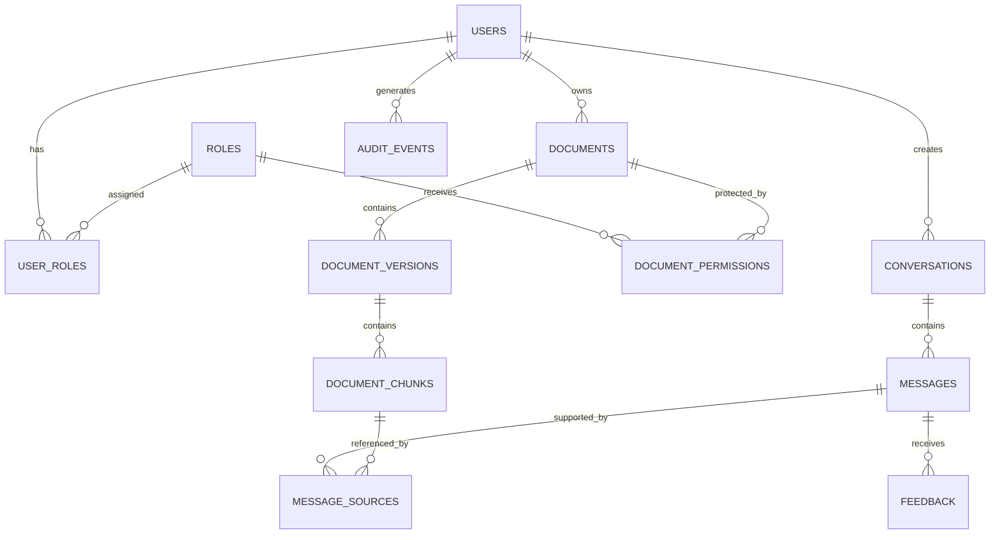

# Data Model

**Project:** Enterprise Knowledge Copilot  
**Document Type:** Database & Data Architecture Specification  
**Status:** Approved Target Design  
**Implementation Status:** 📋 Planned  
**Target Database:** PostgreSQL + PGVector

---

# 1. Purpose

This document defines the target data model for Enterprise Knowledge Copilot.

The database must support more than vector search.

It must provide persistent structures for:

- users;
- roles;
- permissions;
- organisational documents;
- document versions;
- chunks;
- embeddings;
- conversations;
- questions;
- citations;
- feedback;
- audit events.

The central design principle is:

> **Keep organisational metadata, security information and vector retrieval connected.**

---

# 2. Why PostgreSQL + PGVector?

The project requires both structured relational information and semantic vector retrieval.

PostgreSQL provides relational storage for:

```text
Users
Roles
Permissions
Documents
Metadata
Conversations
Feedback
Audit Events
```

PGVector extends PostgreSQL with vector capabilities for:

```text
Document Embeddings
        ↓
Similarity Search
        ↓
Semantic Retrieval
```

This allows the initial system to avoid operating separate relational and vector databases without a demonstrated requirement.

---

# 3. High-Level Data Model



This represents the target logical model.

Implementation may evolve as requirements are validated.

---

# 4. Core Entities

The target database contains the following core entities:

| Entity | Purpose |
|---|---|
| `users` | Application identities |
| `roles` | Access-control roles |
| `user_roles` | User-to-role relationships |
| `documents` | Logical organisational documents |
| `document_versions` | Version/lifecycle information |
| `document_permissions` | Access rules |
| `document_chunks` | Retrieval units + embeddings |
| `conversations` | User conversation sessions |
| `messages` | Questions and generated answers |
| `message_sources` | Evidence/citation relationships |
| `feedback` | User feedback |
| `audit_events` | Security/governance events |

---

# 5. Users

The `users` table represents authenticated application identities.

Conceptual schema:

```text
users
────────────────────────
id
external_auth_id
email
display_name
status
created_at
updated_at
```

Example:

```json
{
  "id": "user-001",
  "external_auth_id": "auth-provider-id",
  "email": "employee@example.com",
  "display_name": "Example Employee",
  "status": "active"
}
```

The example contains synthetic data only.

---

# 6. Why `external_auth_id`?

The application should not require authentication credentials to be stored directly in the application database when an external identity provider is used.

Conceptually:

```text
Identity Provider
      ↓
external_auth_id
      ↓
Application User
```

This separates:

```text
Authentication Credentials
```

from:

```text
Application Profile / Permissions
```

The exact authentication implementation will be selected later.

---

# 7. Roles

The `roles` table represents application access roles.

Conceptual schema:

```text
roles
────────────────────────
id
name
description
created_at
```

Possible roles:

```text
employee
hr
it
finance
administrator
```

These values are examples rather than final organisational policy.

---

# 8. User Roles

Users may require more than one role.

Therefore the relationship should not be represented simply as:

```text
users.role
```

Instead:

```text
users
   ↓
user_roles
   ↓
roles
```

Conceptual schema:

```text
user_roles
────────────────────────
user_id
role_id
assigned_at
```

This creates a many-to-many relationship.

Example:

```text
User A
├── employee
└── hr
```

---

# 9. Documents

The `documents` table represents the logical identity of an organisational document.

Conceptual schema:

```text
documents
────────────────────────
id
title
document_type
department
owner_id
created_at
updated_at
```

Example:

```json
{
  "id": "doc-001",
  "title": "Remote Working Policy",
  "document_type": "policy",
  "department": "HR",
  "owner_id": "user-hr-001"
}
```

---

# 10. Why Separate Documents and Versions?

A policy may change without becoming an entirely unrelated document.

Example:

```text
Remote Working Policy
│
├── Version 1
├── Version 2
└── Version 3
```

Separating logical documents from versions allows the system to understand that these files represent different versions of the same organisational knowledge.

---

# 11. Document Versions

Conceptual schema:

```text
document_versions
────────────────────────
id
document_id
version_number
status
effective_from
effective_until
source_filename
content_hash
created_at
created_by
```

Possible statuses:

```text
draft
active
superseded
archived
```

---

# 12. Document Lifecycle

Example:

```text
Remote Working Policy

v1
status = superseded

v2
status = superseded

v3
status = active
```

Normal employee retrieval should eventually exclude inappropriate lifecycle states.

This reduces the risk of obsolete policies being presented as current organisational truth.

---

# 13. Content Hash

A document version may store a content hash.

Conceptually:

```text
Document Content
       ↓
Hash Function
       ↓
Content Hash
```

Potential uses include:

- duplicate detection;
- change detection;
- ingestion integrity.

The exact hashing implementation will be selected during ingestion development.

---

# 14. Document Permissions

Documents may have different access requirements.

Conceptual schema:

```text
document_permissions
────────────────────────
id
document_id
role_id
permission_type
created_at
```

Example:

```text
Remote Working Policy
    ↓
employee → read
hr       → read

Finance Forecast
    ↓
finance  → read
```

---

# 15. Why Permissions Belong in the Data Model

Permission-aware RAG requires the retrieval layer to know which documents are eligible for the current user.

The relationship is therefore:

```text
User
 ↓
Roles
 ↓
Document Permissions
 ↓
Permitted Documents
 ↓
Permitted Chunks
 ↓
Vector Search
```

Access control cannot exist only in the frontend.

---

# 16. Document Chunks

Document chunks are the primary retrieval units.

Conceptual schema:

```text
document_chunks
────────────────────────
id
document_version_id
chunk_index
section
page_number
content
embedding
token_count
created_at
```

The `embedding` field will use a PGVector vector type with dimensions matching the selected embedding model.

The exact dimension should be taken from the implemented embedding configuration rather than hard-coded into this design document prematurely.

---

# 17. Chunk Example

Conceptually:

```json
{
  "id": "chunk-003",
  "document_version_id": "version-002",
  "chunk_index": 3,
  "section": "Remote Working Allowance",
  "page_number": 4,
  "content": "Employees may work remotely for up to two days per week."
}
```

The corresponding embedding is stored alongside the retrieval record.

---

# 18. Why Store Embeddings With Chunks?

The vector represents the semantic meaning of the chunk.

Therefore:

```text
Chunk
   +
Embedding
   +
Metadata
```

should remain closely connected.

When vector search finds an embedding, the application immediately needs:

```text
content
document
version
section
page
permissions
status
```

to determine whether and how the evidence can be used.

---

# 19. Retrieval Relationship

Conceptually:

```text
Query Embedding
       ↓
PGVector Search
       ↓
document_chunks
       ↓
document_version
       ↓
document
       ↓
permissions
```

The final database query should combine semantic similarity with applicable metadata/access restrictions.

---

# 20. Permission-Aware Vector Search

The intended retrieval behaviour is conceptually:

```sql
SELECT permitted_chunks
FROM document_chunks
JOIN document_versions
JOIN documents
JOIN document_permissions
WHERE user_has_required_permission
  AND document_version.status = 'active'
ORDER BY vector_similarity
LIMIT :top_k;
```

This is conceptual SQL, not the final implementation.

The important architectural point is the order of operations:

> **Restrict eligible knowledge and retrieve from the authorised scope.**

---

# 21. Vector Indexing

As the number of chunks increases, scanning every vector may become inefficient.

PGVector supports vector indexing strategies that may improve retrieval performance.

Index selection should be based on:

- dataset size;
- query performance;
- recall requirements;
- measured latency.

The project should first establish a working baseline before introducing optimisation.

---

# 22. Conversations

The `conversations` table represents user sessions or knowledge discussions.

Conceptual schema:

```text
conversations
────────────────────────
id
user_id
title
created_at
updated_at
```

Conversation persistence is useful for the product experience but should be balanced against privacy and retention requirements.

---

# 23. Messages

Conceptual schema:

```text
messages
────────────────────────
id
conversation_id
role
content
status
created_at
```

Possible roles:

```text
user
assistant
```

Potential statuses:

```text
completed
failed
insufficient_evidence
```

---

# 24. Should Embeddings Be Stored for Questions?

Not necessarily.

Query embeddings can initially be generated at request time.

They only need persistent storage if a later requirement justifies it, such as:

- retrieval analytics;
- caching;
- evaluation;
- repeated-query optimisation.

The architecture should avoid storing data without a clear reason.

---

# 25. Message Sources

A generated answer may rely on several chunks.

The `message_sources` table creates this relationship.

Conceptual schema:

```text
message_sources
────────────────────────
id
message_id
chunk_id
retrieval_rank
retrieval_score
created_at
```

Example:

```text
Assistant Message
│
├── Source 1 → Remote Policy, Chunk 3
└── Source 2 → Remote Policy, Chunk 4
```

---

# 26. Why Persist Source Relationships?

This supports:

- citation reconstruction;
- evaluation;
- debugging;
- auditability;
- source inspection.

Instead of storing only:

```text
"The answer came from Remote Policy."
```

the application can retain the exact chunk relationships used for a response where the product's retention policy permits it.

---

# 27. Feedback

Users may provide feedback about generated answers.

Conceptual schema:

```text
feedback
────────────────────────
id
message_id
user_id
rating
comment
created_at
```

Potential simple rating:

```text
helpful
not_helpful
```

Feedback should not automatically be interpreted as objective model-quality truth.

It is one signal that may help identify:

- retrieval problems;
- missing knowledge;
- confusing answers;
- product usability issues.

---

# 28. Audit Events

The `audit_events` table records security/governance-relevant activity.

Conceptual schema:

```text
audit_events
────────────────────────
id
user_id
event_type
resource_type
resource_id
outcome
metadata
created_at
```

Possible events:

```text
authentication_success
authentication_failure
document_uploaded
document_updated
document_archived
permission_changed
access_denied
```

Audit events should avoid unnecessary storage of sensitive document or prompt content.

---

# 29. Operational Logs vs Database Audit Events

These should not be confused.

### Application Log

Example:

```text
Request failed because database timed out.
```

Used primarily for:

```text
operations
debugging
monitoring
```

### Audit Event

Example:

```text
Administrator changed Finance Policy access permission.
```

Used primarily for:

```text
security
governance
traceability
```

They may use different storage mechanisms in a production deployment.

---

# 30. Proposed Logical Relationships

```text
USER
 │
 ├─────────────┐
 ↓             ↓
USER_ROLE   CONVERSATION
 │             │
 ↓             ↓
ROLE        MESSAGE
 │             │
 ↓             ├──────────────┐
DOCUMENT_      ↓              ↓
PERMISSION  MESSAGE_SOURCE  FEEDBACK
 │             │
 ↓             ↓
DOCUMENT ← DOCUMENT_VERSION
                │
                ↓
          DOCUMENT_CHUNK
                │
                ↓
            EMBEDDING
```

This diagram is conceptual; the Mermaid ER diagram is the primary relationship reference.

---

# 31. Document Retrieval Metadata

A retrieval result should eventually be capable of exposing:

```text
chunk_id
content
similarity_score
document_id
document_title
document_version
document_status
section
page
department
access information
```

Not every field must be returned to the end user.

Some metadata exists for internal decision-making.

---

# 32. API Retrieval Object

The application layer may use an internal structure such as:

```json
{
  "chunk_id": "chunk-003",
  "content": "Employees may work remotely for up to two days per week.",
  "score": 0.84,
  "source": {
    "document_id": "doc-001",
    "title": "Remote Working Policy",
    "version": "2.0",
    "section": "3.1",
    "page": 4
  }
}
```

All values are illustrative.

The final implementation may use Pydantic models or equivalent typed structures.

---

# 33. User-Facing Citation Object

The frontend should receive only metadata appropriate for users.

For example:

```json
{
  "title": "Remote Working Policy",
  "section": "3.1",
  "page": 4,
  "version": "2.0"
}
```

Internal fields such as database IDs or access-control metadata do not necessarily need to be exposed.

---

# 34. Data Integrity

The database should enforce integrity where practical.

Examples include:

- primary keys;
- foreign keys;
- uniqueness constraints;
- required fields;
- lifecycle rules;
- valid relationship constraints.

Application validation and database constraints should complement each other.

---

# 35. Deletion Strategy

Enterprise document deletion requires deliberate design.

Deleting:

```text
Document
```

may affect:

```text
Versions
Chunks
Embeddings
Citations
Audit Records
```

Therefore deletion behaviour should not be implemented as uncontrolled cascading removal without considering traceability requirements.

Possible lifecycle behaviour:

```text
Active
  ↓
Archived
  ↓
Retention Policy
  ↓
Deletion where permitted
```

The final policy depends on product requirements.

---

# 36. Conversation Retention

Conversation data may contain sensitive information.

The system should therefore avoid assuming:

```text
Store everything forever.
```

The final product should define:

- retention duration;
- deletion behaviour;
- user visibility;
- administrator visibility;
- logging boundaries.

For the portfolio implementation, unnecessary personal or confidential data should not be collected.

---

# 37. Synthetic Development Dataset

Development will use synthetic organisational documents.

Potential categories:

```text
HR
├── Annual Leave Policy
├── Remote Working Policy
└── Parental Leave Policy

IT
├── Password Security Policy
└── Acceptable Use Policy

Finance
└── Synthetic Restricted Finance Policy
```

The restricted synthetic document is useful for testing permission-aware retrieval without exposing real confidential information.

---

# 38. Data Required for RAG Evaluation

Evaluation records should remain separate from production knowledge records where practical.

Conceptually:

```text
evaluation_cases
────────────────────────
id
question
expected_document
expected_section
expected_evidence
test_user_role
category
```

Example:

```json
{
  "question": "Can employees work remotely?",
  "expected_document": "Remote Working Policy",
  "expected_section": "3.1",
  "test_user_role": "employee",
  "category": "supported"
}
```

---

# 39. Security Evaluation Data

The evaluation set should include permission scenarios.

Example:

```json
{
  "question": "What does the restricted finance policy say?",
  "expected_document": null,
  "test_user_role": "employee",
  "category": "unauthorised"
}
```

The expected behaviour is not merely:

```text
LLM refuses.
```

The stronger requirement is:

```text
Restricted document was never retrieved into the LLM context.
```

---

# 40. Insufficient-Evidence Evaluation Data

Example:

```json
{
  "question": "What is the company car allowance?",
  "expected_document": null,
  "category": "unsupported"
}
```

This allows the system to test whether it invents organisational information when no supporting document exists.

---

# 41. Database Migration Strategy

Database schema changes should eventually be managed through migrations rather than manually editing production databases.

Conceptually:

```text
Application Version
       ↓
Migration
       ↓
Database Schema Version
```

A migration tool will be selected when database implementation begins.

The tool should solve the schema-versioning requirement rather than being added solely for portfolio visibility.

---

# 42. Data Access Layer

Database queries should not be scattered throughout FastAPI endpoints.

Target direction:

```text
API
 ↓
Application Service
 ↓
Repository / Data Access Layer
 ↓
PostgreSQL
```

For example:

```text
RetrievalService
      ↓
ChunkRepository
      ↓
PGVector
```

This improves separation of concerns and testability.

---

# 43. Transaction Boundaries

Some operations require multiple database changes to succeed together.

Example document ingestion:

```text
Create Document Version
        +
Create Chunks
        +
Store Embeddings
```

If processing fails halfway through, the database should not silently represent incomplete data as a fully indexed document.

Transaction behaviour will be designed during persistence implementation.

---

# 44. Database Performance

Performance should be measured rather than assumed.

Potential measurements include:

```text
Vector Search Latency
Metadata Filter Latency
Document Ingestion Time
Database Query Latency
```

Optimisations such as additional indexes should be introduced based on actual query patterns.

---

# 45. Data Model and RAG

The data model supports the RAG system directly.

```text
Documents
   ↓
Versions
   ↓
Chunks
   ↓
Embeddings
   ↓
Permission-Aware Retrieval
   ↓
Evidence
   ↓
Message Sources
   ↓
Citations
```

RAG is therefore not an isolated AI component.

It depends heavily on good data modelling.

---

# 46. Data Model and Security

The security relationship is:

```text
User
 ↓
User Roles
 ↓
Roles
 ↓
Document Permissions
 ↓
Documents
 ↓
Active Versions
 ↓
Permitted Chunks
 ↓
Vector Retrieval
```

This supports the project's core principle:

> **Authorisation before generation.**

---

# 47. Data Model and Traceability

The source relationship is:

```text
Generated Message
       ↓
Message Sources
       ↓
Document Chunks
       ↓
Document Version
       ↓
Document
```

This makes it possible to trace a generated response back to the evidence used by the system, subject to the chosen retention design.

---

# 48. Current Data Status

## Current Prototype

The current learning implementation uses:

```text
Python List
      ↓
Synthetic Policy Strings
      ↓
Generated Embeddings
      ↓
In-Memory Similarity Search
```

This is intentionally temporary.

---

## Target Implementation

```text
PostgreSQL
     +
PGVector
     ↓
Persistent Documents
     ↓
Versions
     ↓
Metadata-Rich Chunks
     ↓
Embeddings
     ↓
Permission-Aware Vector Retrieval
```

No claim is made that this persistent model has already been implemented.

---

# 49. Data Design Decisions

| Decision | Rationale |
|---|---|
| PostgreSQL | Mature relational persistence |
| PGVector | Vector retrieval inside PostgreSQL |
| Separate documents and versions | Support lifecycle management |
| Metadata-rich chunks | Retrieval, citations and filtering |
| Many-to-many user roles | Flexible access model |
| Explicit document permissions | Support permission-aware retrieval |
| Message-source relationship | Trace generated answers to evidence |
| Synthetic development data | Avoid confidential-data exposure |
| Minimal conversation retention | Reduce unnecessary sensitive storage |
| Migration-based schema evolution | Reproducible database changes |

---

# 50. Data Architecture North Star

The database is not simply a place to store embeddings.

It must answer:

```text
Who is asking?
        ↓
What can they access?
        ↓
Which document is current?
        ↓
Which chunks are relevant?
        ↓
Which evidence supported the answer?
```

Therefore the target architecture is:

> **Relational metadata + vector retrieval + security relationships + source traceability.**

That combination allows PostgreSQL and PGVector to support the wider enterprise RAG architecture rather than acting as a standalone vector store.
