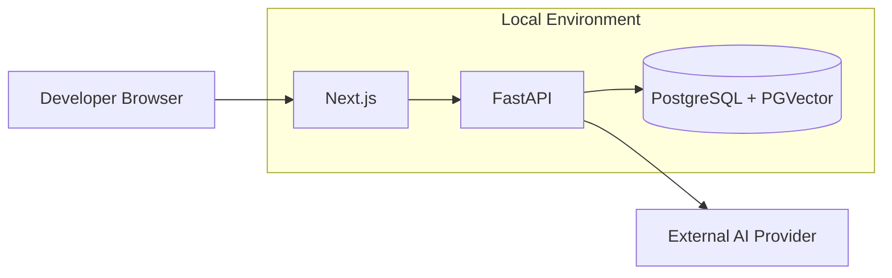
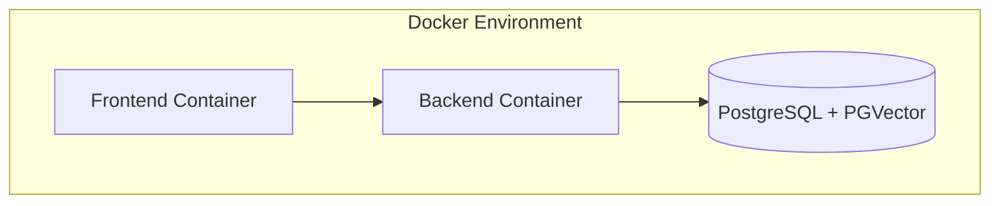
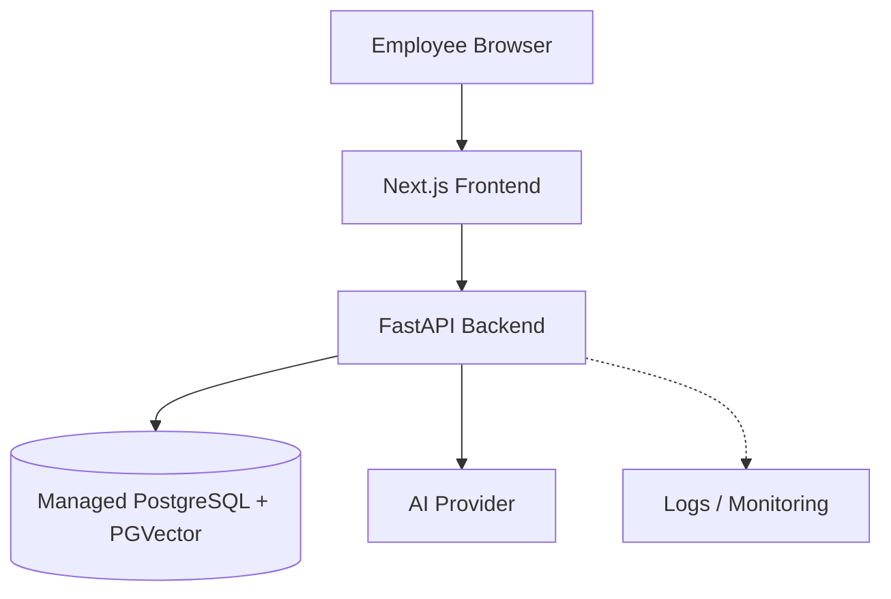
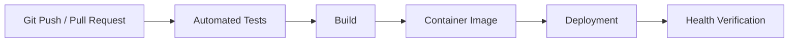

# Deployment Strategy

**Project:** Enterprise Knowledge Copilot  
**Document Type:** Deployment & Runtime Architecture  
**Status:** Approved Target Design  
**Implementation Status:** 📋 Planned  
**Deployment Principle:** Portable, reproducible, secure and free-first during portfolio development

---

# 1. Purpose

This document defines the deployment strategy for Enterprise Knowledge Copilot.

The application will eventually contain several runtime concerns:

- Next.js frontend;
- FastAPI backend;
- PostgreSQL;
- PGVector;
- external AI services;
- authentication;
- secrets;
- observability;
- CI/CD.

The objective is not simply to make the application accessible on the internet.

The deployment should demonstrate understanding of:

```text
Build
Package
Configure
Deploy
Verify
Observe
Recover
```

The central principle is:

> **A deployment is successful only when the application can be reproduced, configured securely, verified and operated.**

---

# 2. Deployment Goals

The target deployment should provide:

- reproducible application environments;
- separation of configuration from code;
- secure secret handling;
- persistent application data;
- health monitoring;
- automated testing before deployment;
- repeatable builds;
- environment isolation;
- controlled releases;
- operational visibility;
- rollback capability where supported.

---

# 3. Deployment Environments

The project should conceptually distinguish:

```text
Development
    ↓
CI / Test
    ↓
Production / Portfolio Demo
```

These environments may use different infrastructure while preserving the same application architecture.

---

# 4. Development Environment

The development environment is used for:

```text
Coding
Debugging
Testing
RAG Experiments
Database Development
Frontend Development
```

Target local architecture:



---

# 5. Containerisation Strategy

Docker will be used to create reproducible application runtime environments.

Target containers:

```text
Frontend Container
Backend Container
Database Container
```

Conceptually:



The external AI provider remains outside the local container environment.

---

# 6. Why Docker?

Without containers:

```text
Developer A
Python Version X
Node Version Y
Different Dependencies

Developer B
Python Version Z
Node Version W
Different Dependencies
```

can produce inconsistent behaviour.

Docker allows runtime requirements to be defined explicitly.

Conceptually:

```text
Application
+
Runtime
+
Dependencies
+
Configuration Expectations
=
Container Image
```

---

# 7. Backend Container

The backend image will contain:

```text
Python Runtime
Application Code
Python Dependencies
FastAPI Runtime
```

It should not contain:

```text
.env
API Keys
Production Database Passwords
Authentication Secrets
```

Secrets should be injected at runtime.

---

# 8. Frontend Container

The frontend image will contain the Next.js application and required Node.js dependencies.

Configuration that is safe for the browser must remain separate from server-only secrets.

The frontend must never receive private backend credentials merely because both applications belong to the same project.

---

# 9. Database Container

Local development should use:

```text
PostgreSQL + PGVector
```

through Docker.

Database storage should use persistent volumes where appropriate.

Without persistence:

```text
Container Removed
      ↓
Database Data Lost
```

With a volume:

```text
Container Removed
      ↓
Persistent Data Remains
```

---

# 10. Docker Compose

Docker Compose will coordinate the local services.

Conceptually:

```yaml
services:

  frontend:
    # Next.js application

  backend:
    # FastAPI application

  database:
    # PostgreSQL + PGVector
```

The final Compose configuration will be created during implementation rather than copied blindly from documentation.

---

# 11. Local Service Communication

Inside a container network:

```text
Frontend
   ↓
Backend
   ↓
Database
```

services should communicate using configured service addresses rather than assuming every dependency is available at:

```text
localhost
```

This distinction becomes important once applications run in separate containers.

---

# 12. Configuration

Application configuration should be provided through environment variables.

Examples may include:

```text
DATABASE_URL
GEMINI_API_KEY
APP_ENV
LOG_LEVEL
FRONTEND_ORIGIN
```

Actual names will follow the implemented configuration layer.

---

# 13. Local Environment Variables

Local development may use:

```text
.env
```

The file must remain outside Git version control.

The repository may provide:

```text
.env.example
```

containing placeholders such as:

```text
GEMINI_API_KEY=
DATABASE_URL=
```

Never:

```text
GEMINI_API_KEY=real-secret
```

---

# 14. Production Secrets

Production secrets should be stored through the selected deployment platform's secret-management mechanism.

Conceptually:

```text
Secret Store
    ↓
Runtime Environment
    ↓
Application
```

not:

```text
GitHub Repository
    ↓
Hard-Coded Secret
```

---

# 15. Secret Rotation

The architecture should allow a credential to be replaced without requiring source-code modification.

For example:

```text
Old API Key
    ↓
Rotate Secret
    ↓
Restart / Redeploy Application
    ↓
New API Key
```

This is another reason configuration should remain outside application code.

---

# 16. Production Architecture

A target hosted architecture may look like:



The specific hosting providers will be selected during deployment implementation.

---

# 17. Free-First Portfolio Deployment

The portfolio currently operates under a:

```text
£0 development budget
```

Therefore hosting decisions should prioritise services with suitable free development tiers where available.

The deployment architecture should remain portable so that the application is not fundamentally dependent on a free-tier provider.

---

# 18. Free Tier Is a Constraint, Not an Architecture

The system should not be designed around unusual limitations simply because one provider currently offers a free plan.

Instead:

```text
Application Architecture
        ↓
Deployment Interface
        ↓
Selected Hosting Platform
```

This makes migration easier later.

---

# 19. Hosting Selection Criteria

Before selecting hosting providers, evaluate:

```text
Current Free Tier
Container Support
PostgreSQL Support
PGVector Support
Environment Variables
Secret Management
HTTPS
Deployment Automation
Resource Limits
Sleep / Cold Start Behaviour
Persistent Storage
Regional Availability
```

Free-tier conditions can change.

Therefore the actual provider should be verified at deployment time.

---

# 20. Frontend Hosting

The Next.js frontend may be hosted separately from the backend.

Conceptually:

```text
Browser
   ↓
Frontend Hosting
   ↓ HTTPS
Backend Hosting
```

The final provider will be selected based on current free-tier availability and technical compatibility.

---

# 21. Backend Hosting

The FastAPI backend requires a runtime capable of running the Python application.

Target characteristics include:

```text
Python or Container Support
Environment Variables
HTTPS
Logs
Health Checks
Network Access to Database
```

Container deployment is preferred where practical because it improves portability.

---

# 22. Database Hosting

The hosted application requires persistent PostgreSQL storage with vector capability.

Target:

```text
PostgreSQL
+
PGVector Extension
```

The selected service must be verified to support the required extension.

---

# 23. Database Persistence

Production application data must not depend on the lifecycle of the backend container.

Correct separation:

```text
Backend Runtime
      ↓
Persistent Database
```

not:

```text
Backend Container
contains permanent database state
```

---

# 24. Database Migrations

Database schema changes should eventually be managed through migrations.

Conceptually:

```text
Schema Version 1
      ↓
Migration
      ↓
Schema Version 2
```

This is safer than manually changing production tables without versioned history.

The specific migration tooling will be selected when the persistent database layer is implemented.

---

# 25. HTTPS

Production-facing communication should use:

```text
HTTPS
```

rather than unencrypted public HTTP.

Conceptually:

```text
Browser
   ↓ HTTPS
Frontend

Frontend
   ↓ HTTPS
Backend
```

The selected hosting platform may provide TLS termination.

---

# 26. CORS

If the frontend and backend use different origins, FastAPI must allow only the required frontend origins.

Example concept:

```text
https://copilot.example
```

rather than relying on:

```text
*
```

for credentialed production requests.

---

# 27. Authentication in Deployment

Authentication configuration must differ appropriately between:

```text
Development
```

and:

```text
Production
```

Redirect URLs, cookies, tokens or provider settings must match the deployed domains.

Authentication secrets must remain outside source control.

---

# 28. Deployment Pipeline

Target CI/CD flow:



Deployment should not occur if required validation fails.

---

# 29. GitHub Actions

GitHub Actions is the target CI/CD platform.

Potential workflow:

```text
Push / Pull Request
        ↓
Checkout Repository
        ↓
Install Dependencies
        ↓
Run Tests
        ↓
Build Application
        ↓
Build Container
        ↓
Deploy where configured
```

The exact workflow will be implemented after the testing and Docker foundations exist.

---

# 30. Pull Request Validation

Before merging important changes, CI should eventually verify:

```text
Backend Tests
Frontend Tests
API Tests
Security-Critical Tests
Build Success
```

RAG evaluations requiring external API calls may be handled separately depending on:

- cost;
- runtime;
- nondeterminism;
- credentials.

---

# 31. Build Once Principle

Where practical:

```text
Build
   ↓
Test Artifact
   ↓
Deploy Same Artifact
```

is preferable to rebuilding different application code for each environment.

Container images support this deployment model.

---

# 32. Image Tagging

Container images should eventually have identifiable versions.

Possible strategies include:

```text
Git Commit SHA
Release Version
```

Example concept:

```text
backend:<commit-sha>
```

This helps answer:

> Which version is currently deployed?

---

# 33. Health Checks

The current backend has a basic:

```http
GET /health
```

endpoint.

This demonstrates application liveness.

Deployment infrastructure may use health checks to determine whether the backend can respond.

---

# 34. Liveness vs Readiness

These concepts should remain distinct.

## Liveness

```text
Is the application process running?
```

## Readiness

```text
Is the application capable of serving required requests?
```

An application can be alive while PostgreSQL is unavailable.

A future readiness check may therefore evaluate required dependencies.

---

# 35. Deployment Verification

A successful deployment should be verified.

Conceptually:

```text
Deployment Complete
      ↓
Health Check
      ↓
Readiness Check
      ↓
Basic API Smoke Test
      ↓
Frontend Smoke Test
      ↓
RAG Smoke Test
```

A CI/CD platform reporting:

```text
deployment succeeded
```

is not by itself proof that the application works correctly.

---

# 36. Smoke Tests

Post-deployment smoke tests may include:

```text
Can frontend load?

Can backend respond?

Can database connection succeed?

Can a known synthetic policy question complete?

Can citations be returned?
```

Tests should use synthetic data and controlled credentials.

---

# 37. Deployment Failure

If deployment verification fails:

```text
New Release
    ↓
Health Failure
    ↓
Do Not Treat as Healthy
    ↓
Investigate / Roll Back
```

The deployment process should make failure visible.

---

# 38. Rollback Strategy

A production-oriented system should consider rollback before failure occurs.

Conceptually:

```text
Version N
   ↓
Deploy Version N+1
   ↓
Critical Failure
   ↓
Restore Version N
```

The exact mechanism depends on the hosting platform.

---

# 39. Database Rollback Complexity

Application rollback and database rollback are not identical.

A destructive database migration may make an older application version incompatible.

Therefore migrations should be designed carefully.

Where possible, prefer backwards-compatible migration sequences.

---

# 40. Deployment Logs

Deployment operations should provide enough information to determine:

```text
What version was deployed?

When was it deployed?

Did the build succeed?

Did tests succeed?

Did health verification succeed?

Why did deployment fail?
```

Secrets must not appear in build logs.

---

# 41. Runtime Logs

Once deployed, the application should provide runtime telemetry as defined in:

```text
docs/observability.md
```

This includes eventual support for:

```text
Request IDs
Structured Logs
Latency
Errors
Retrieval Events
LLM Events
```

---

# 42. External AI Dependency

The AI provider remains an external runtime dependency.

Conceptually:

```text
FastAPI
   ↓ HTTPS
LLM / Embedding Provider
```

The backend should be responsible for provider interaction.

The browser should not receive private AI-provider credentials.

---

# 43. Provider Failure

If the external model provider is unavailable:

```text
Backend
   ↓
Provider Failure
   ↓
Controlled Application Error
```

The application should not attempt to fabricate an organisational answer without its required generation dependency.

---

# 44. Database Failure

If the database is unavailable:

```text
Question
   ↓
Retrieval unavailable
   ↓
Controlled Service Failure
```

The system must not reinterpret this as:

```text
No evidence exists
```

because those are different conditions.

---

# 45. Environment Separation

Different environments should not accidentally share critical resources.

Conceptually:

```text
Development
    ↓
Development Database

Production
    ↓
Production Database
```

Development experiments should not modify production knowledge.

---

# 46. Synthetic Portfolio Data

The public portfolio deployment should use:

```text
Synthetic Organisational Documents
```

rather than:

```text
Real Confidential Employer Documents
```

This allows enterprise scenarios to be demonstrated safely.

---

# 47. Deployment Security

Deployment must protect:

```text
API Keys
Database Credentials
Authentication Secrets
Internal Configuration
```

Security controls include:

```text
Secret Management
HTTPS
Restricted Database Access
Environment Separation
Dependency Updates
Access Control
Safe Logging
```

---

# 48. Database Network Exposure

The database should not be publicly exposed without necessity.

Preferred conceptual communication:

```text
Backend
   ↓
Database
```

rather than:

```text
Internet
   ↓
Database
```

Network configuration depends on the chosen hosting environment.

---

# 49. Dependency Security

Container and application dependencies should be kept under version control through appropriate manifests and lockfiles.

Backend:

```text
pyproject.toml
uv.lock
```

Frontend will have corresponding Node package metadata.

CI may later include dependency/security checks where practical.

---

# 50. Container Security

Container images should follow principles such as:

```text
Use appropriate base image
Install only required dependencies
Do not bake secrets into image
Avoid unnecessary runtime tools
Run with least privilege where practical
```

Containerisation does not automatically make an application secure.

---

# 51. Resource Limits

Free hosting platforms may impose restrictions such as:

```text
Memory Limits
CPU Limits
Request Limits
Database Limits
Cold Starts
Sleep Periods
```

These should be measured and documented honestly.

A portfolio deployment should not be described as highly scalable merely because it is containerised.

---

# 52. Cold Starts

Some free hosting environments may suspend inactive applications.

The first request after inactivity may therefore experience additional latency.

If this occurs in the final deployment, it should be documented rather than hidden.

---

# 53. Scaling Strategy

Initial deployment:

```text
Single Frontend
Single Backend
Single PostgreSQL Database
```

is sufficient for the portfolio unless measured demand proves otherwise.

Potential future scaling:

```text
Multiple Backend Instances
        ↓
Load Balancing
        ↓
Shared PostgreSQL
```

should only be introduced when justified.

---

# 54. Kubernetes Decision

Kubernetes is not required for the initial deployment.

Current architecture:

```text
Frontend
Backend
Database
```

does not by itself justify Kubernetes complexity.

Kubernetes fundamentals may still be studied because they are relevant to enterprise engineering roles.

---

# 55. Terraform Decision

Terraform may be introduced after the project has stable infrastructure worth provisioning.

Potential future flow:

```text
Terraform Configuration
        ↓
Cloud Infrastructure
        ↓
Repeatable Environment
```

It is not necessary to write infrastructure-as-code before the deployment architecture exists.

---

# 56. Production Database Backup

A real production deployment would require an explicit backup and recovery strategy.

Potential requirements include:

```text
Scheduled Backups
Retention Policy
Restore Testing
Recovery Objectives
```

The portfolio deployment may rely on the selected managed database capabilities, but these limitations should be documented.

---

# 57. Disaster Recovery

Enterprise production systems normally define:

```text
RPO
Recovery Point Objective

RTO
Recovery Time Objective
```

The portfolio project should understand these concepts without inventing production targets that have not been established.

---

# 58. Zero-Downtime Deployment

Zero-downtime deployment is not an initial portfolio requirement.

If the application later requires continuous availability, strategies such as:

```text
Rolling Deployment
Blue/Green Deployment
```

may be evaluated.

Adding them now would introduce complexity without a demonstrated requirement.

---

# 59. Deployment Observability

After deployment, engineering should be able to determine:

```text
Application Version
Application Health
Request Volume
Error Rate
Latency
Database Availability
LLM Provider Failures
```

This connects deployment with the observability architecture.

---

# 60. Deployment Acceptance Criteria

The initial portfolio deployment is complete when:

- frontend is accessible;
- backend is accessible through the intended interface;
- HTTPS is used for public traffic;
- PostgreSQL data persists;
- PGVector retrieval works;
- environment variables are configured;
- secrets are absent from source control;
- synthetic organisational data is loaded;
- authentication works if included in the release milestone;
- permission-aware retrieval works;
- RAG returns grounded answers;
- citations are displayed;
- insufficient-evidence behaviour works;
- health verification succeeds;
- automated tests run before deployment;
- deployment process is documented;
- actual limitations are documented.

---

# 61. Current Deployment Status

## Implemented Foundation

Current development work has established:

```text
Git Repository
Python Project
uv Dependency Management
FastAPI Application
Environment-Based Gemini Secret
Basic Health Endpoint
```

---

## Not Yet Implemented

The project has not yet implemented or verified:

```text
Docker
Docker Compose
Hosted PostgreSQL
Hosted PGVector
Frontend Hosting
Backend Hosting
Production Authentication
CI/CD Deployment
Production Observability
Automated Rollback
Terraform
Kubernetes
```

These must not be represented as completed portfolio features.

---

# 62. Deployment Roadmap

Target progression:

```text
Application Works Locally
        ↓
PostgreSQL + PGVector
        ↓
Frontend + Backend Integration
        ↓
Dockerise Backend
        ↓
Dockerise Frontend
        ↓
Docker Compose
        ↓
Automated Tests
        ↓
GitHub Actions
        ↓
Select Free-First Hosting
        ↓
Configure Secrets
        ↓
Deploy
        ↓
Smoke Test
        ↓
Observe
        ↓
Document Actual Results
```

---

# 63. Portfolio Deployment Evidence

The final repository should contain evidence such as:

```text
Dockerfiles
docker-compose configuration
CI/CD workflow
deployment documentation
architecture diagram
environment variable template
health checks
test results
deployment URL where available
screenshots
measured latency/evaluation results
```

Only evidence that actually exists should be presented.

---

# 64. Interview Explanation

If asked:

> "How would you deploy your Enterprise Knowledge Copilot?"

A strong architecture explanation is:

```text
I would containerise the Next.js frontend and FastAPI backend,
while PostgreSQL with PGVector provides persistent relational
and vector storage.

Secrets would be injected through the deployment environment
rather than stored in the repository.

GitHub Actions would run tests and build validation before
deployment.

The deployed application would expose health and, where useful,
readiness checks.

After deployment I would run smoke tests and use structured
observability to verify API, retrieval, database and LLM behaviour.

For the portfolio I am using a free-first deployment strategy,
but the application architecture remains portable rather than
being tightly designed around one hosting provider.
```

---

# 65. Deployment North Star

The deployment journey is:

```text
SOURCE
  ↓
GitHub
  ↓
TEST
  ↓
BUILD
  ↓
CONTAINERISE
  ↓
CONFIGURE
  ↓
DEPLOY
  ↓
VERIFY
  ↓
OBSERVE
  ↓
RECOVER
```

The project should demonstrate more than:

```text
"It works on my machine."
```

The target is:

> **The application can be built reproducibly, configured securely, deployed predictably, verified after release, observed while running and recovered when something fails.**
