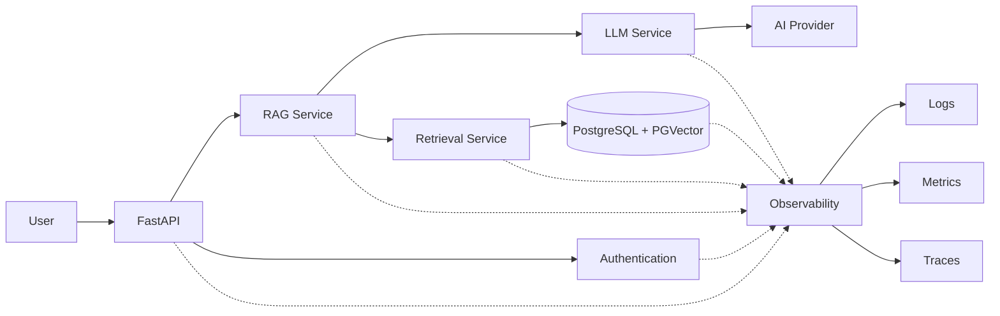

# Observability Strategy

**Project:** Enterprise Knowledge Copilot  
**Document Type:** Observability & Operational Monitoring Specification  
**Status:** Approved Target Design  
**Implementation Status:** 📋 Planned

---

# 1. Purpose

This document defines the target observability strategy for Enterprise Knowledge Copilot.

The application combines conventional software components with probabilistic AI components.

A request may involve:

- FastAPI;
- authentication;
- authorisation;
- query embeddings;
- PostgreSQL;
- PGVector retrieval;
- RAG orchestration;
- an external LLM provider;
- source citations.

When something goes wrong, the engineering team must be able to determine where the failure occurred.

The central principle is:

> **An AI application should be explainable operationally, not only conversationally.**

---

# 2. What Observability Means

Observability is the ability to understand the internal behaviour of a running system from the information it exposes.

The project will focus on three conventional observability signals:

```text
Logs
Metrics
Traces
```

For this RAG application, these signals should also expose useful AI-specific operational information.

---

# 3. Observability Architecture



This represents the target architecture rather than the current implementation.

---

# 4. Why RAG Observability Matters

Consider a user reporting:

```text
"The Copilot gave me the wrong remote-working policy."
```

Several failures are possible:

```text
Wrong document version retrieved

Correct document retrieved but wrong chunk selected

Correct evidence retrieved but LLM ignored it

Correct answer generated but wrong citation attached

User lacked permission but restricted evidence was retrieved

Database retrieval failed

Embedding provider failed

LLM provider failed
```

Without observability these failures may appear identical from the user's perspective.

---

# 5. Request Correlation

Every application request should eventually receive a unique request identifier.

Example:

```text
request_id = req-8f29c1
```

The same identifier should follow the request through relevant application components.

Conceptually:

```text
HTTP Request
     │
     │ req-8f29c1
     ↓
FastAPI
     │
     ↓
Authentication
     │
     ↓
RAG Service
     │
     ↓
Retrieval
     │
     ↓
LLM Service
     │
     ↓
HTTP Response
```

This allows events from one request to be correlated.

---

# 6. Structured Logging

The application should prefer structured logging over unstructured `print()` statements for production-oriented diagnostics.

Instead of:

```text
Something went wrong retrieving stuff.
```

a structured event could conceptually contain:

```json
{
  "event": "retrieval_completed",
  "request_id": "req-8f29c1",
  "result_count": 3,
  "duration_ms": 82
}
```

The values above are illustrative.

---

# 7. Why Structured Logs?

Structured logs make it easier to:

- search events;
- filter failures;
- aggregate metrics;
- correlate requests;
- analyse latency;
- build dashboards later.

They also encourage consistent event naming.

---

# 8. Logging Levels

The application may use conventional levels such as:

```text
DEBUG
INFO
WARNING
ERROR
CRITICAL
```

Examples:

```text
INFO
Question request completed.

WARNING
No sufficient evidence found.

ERROR
LLM provider request failed.

CRITICAL
Required application dependency unavailable.
```

Logging levels should be used consistently rather than treating every event as an error.

---

# 9. API Observability

Useful API-level signals include:

```text
request_id
HTTP method
endpoint
response status
request duration
authenticated/unauthenticated state
controlled error code
```

Avoid logging authentication tokens or sensitive request bodies indiscriminately.

---

# 10. Retrieval Observability

Retrieval is one of the most important areas to observe.

Potential retrieval telemetry includes:

```text
request_id
retrieval duration
Top-K value
number of candidate chunks
number of returned chunks
retrieved chunk IDs
retrieved document IDs
retrieval ranks
similarity scores
metadata filters applied
```

This information is primarily for engineering and evaluation rather than normal end users.

---

# 11. Why Observe Retrieval?

Suppose the final answer is wrong.

A retrieval trace might show:

```text
Question
   ↓
Top-3
   ↓
1. Annual Leave Policy
2. Password Policy
3. Remote Working Policy
```

If the expected Remote Working Policy is ranked third, the engineering problem may be retrieval quality.

If instead the correct source is ranked first but the answer is still wrong, investigation should focus on generation or prompt construction.

---

# 12. Retrieval Trace Example

Conceptually:

```json
{
  "event": "retrieval_completed",
  "request_id": "req-123",
  "top_k": 3,
  "results": [
    {
      "chunk_id": "chunk-17",
      "document_id": "doc-4",
      "rank": 1,
      "score": 0.81
    }
  ],
  "duration_ms": 74
}
```

All values are illustrative.

Whether individual chunk IDs and scores are retained in production logs should depend on privacy and operational requirements.

---

# 13. Security-Aware Retrieval Observability

Permission filtering should also be observable.

Useful internal events may include:

```text
authorisation_scope_resolved
retrieval_filter_applied
access_denied
```

However, logs should not reveal restricted document contents.

The objective is to prove that security controls operated without creating another data-leakage channel through logs.

---

# 14. LLM Observability

The LLM Service should expose useful operational information where available.

Potential signals include:

```text
provider
model
generation duration
request success/failure
input token count
output token count
retry count
provider error category
```

Exact available telemetry depends on the selected provider and API.

---

# 15. What Should Not Be Logged Automatically

The project should avoid automatically recording:

```text
Full prompts
Full retrieved confidential documents
Passwords
API keys
Authentication tokens
Database credentials
Personal information
Complete user conversations
```

Observability should not create a secondary copy of sensitive organisational knowledge.

---

# 16. Prompt Logging

Full prompt logging can be useful during local debugging but may expose:

```text
User Question
+
Retrieved Organisational Evidence
+
Application Instructions
```

Therefore production prompt logging should not be enabled casually.

Safer telemetry may record:

```text
prompt_version
number_of_context_chunks
context_token_count
model
```

without recording the complete prompt.

---

# 17. Model Usage

Where supported, the application may observe:

```text
input tokens
output tokens
total tokens
```

This helps understand:

- latency;
- context size;
- model usage;
- future cost.

Token counts should not be confused with answer quality.

---

# 18. RAG-Level Trace

A complete RAG trace may conceptually look like:

```text
Request: req-123

API validation
    8 ms

Authentication
    20 ms

Query embedding
    130 ms

Permission-aware retrieval
    65 ms

Evidence assessment
    4 ms

Prompt construction
    3 ms

LLM generation
    900 ms

Response construction
    5 ms

TOTAL
    1135 ms
```

These values are examples only.

The project will report real values only after measurement.

---

# 19. Distributed Tracing

Even though the initial application is a modular monolith, tracing concepts remain useful.

A request can be represented as:

```text
Question Request
│
├── Authentication Span
├── Embedding Span
├── Retrieval Span
│   └── Database Query Span
├── RAG Span
└── LLM Generation Span
```

This identifies which operation consumed time or failed.

---

# 20. Metrics

Metrics provide aggregated information about system behaviour over time.

Potential application metrics include:

```text
request_count
request_latency
error_count
```

Potential RAG metrics include:

```text
retrieval_latency
retrieved_chunk_count
insufficient_evidence_count
LLM_latency
provider_error_count
```

Potential security metrics include:

```text
authentication_failure_count
access_denied_count
```

Metric collection should remain proportional to actual operational needs.

---

# 21. Technical Metrics vs Quality Metrics

These should remain distinct.

Technical metric:

```text
LLM latency = 900 ms
```

Quality metric:

```text
Expected source retrieved = yes
```

Observability primarily concerns running-system behaviour.

Evaluation primarily concerns system quality against known test cases.

The two can complement each other.

---

# 22. Core Service Metrics

## API

```text
Request Count
Response Status
Request Latency
Error Rate
```

## Retrieval

```text
Retrieval Count
Retrieval Latency
Returned Chunk Count
Insufficient Evidence Count
```

## Database

```text
Query Latency
Connection Failure
Query Failure
```

## LLM

```text
Generation Latency
Provider Errors
Token Usage where available
```

---

# 23. Latency Percentiles

Average latency alone may hide slow requests.

Operational monitoring may eventually use:

```text
p50
p95
p99
```

For example:

```text
p50 = typical request
p95 = slower tail
p99 = extreme tail
```

Actual values should only be reported after sufficient measurements exist.

---

# 24. Error Classification

Errors should be categorised.

Possible categories:

```text
VALIDATION_ERROR
AUTHENTICATION_ERROR
AUTHORISATION_ERROR
DATABASE_ERROR
RETRIEVAL_ERROR
EMBEDDING_PROVIDER_ERROR
LLM_PROVIDER_ERROR
INGESTION_ERROR
INTERNAL_ERROR
```

This is more useful than recording every failure simply as:

```text
ERROR
```

---

# 25. Dependency Observability

External dependencies should be distinguishable.

Conceptually:

```text
Application
│
├── PostgreSQL
├── Embedding Provider
└── LLM Provider
```

If the LLM provider fails while PostgreSQL remains healthy, telemetry should make the difference visible.

---

# 26. Insufficient Evidence Is Not a System Error

This distinction is important.

```text
No sufficient organisational evidence
```

should not automatically produce:

```text
ERROR
```

It is a valid RAG outcome.

Instead, the application may record:

```text
rag_outcome = insufficient_evidence
```

This allows engineers to analyse how frequently users ask questions outside the available knowledge base.

---

# 27. RAG Outcome Classification

Potential outcome categories include:

```text
answered
insufficient_evidence
access_denied
retrieval_failure
generation_failure
```

These categories can help distinguish product behaviour from infrastructure failures.

---

# 28. Document Ingestion Observability

Document processing should eventually expose stages such as:

```text
upload_received
validation_completed
text_extraction_completed
chunking_completed
embedding_completed
indexing_completed
ingestion_completed
ingestion_failed
```

This allows ingestion failures to be located precisely.

---

# 29. Ingestion Trace

Conceptually:

```text
Document Upload
      ↓
Validation       PASS
      ↓
Extraction       PASS
      ↓
Chunking         PASS
      ↓
Embedding        FAIL
```

Without stage-level observability the user may only see:

```text
Upload failed.
```

while engineering teams lack the information needed to diagnose the failure.

---

# 30. Audit Events vs Observability

Auditability and observability overlap but have different primary purposes.

## Observability

Answers:

> What is the system doing and why did it fail?

## Audit

Answers:

> Who performed a security or governance-relevant action?

Example observability event:

```text
Database query timed out.
```

Example audit event:

```text
Administrator changed document permissions.
```

These concerns should not be merged blindly.

---

# 31. Privacy-Aware Observability

Observability data itself must be treated as potentially sensitive.

Potentially sensitive information includes:

```text
User identifiers
Document identifiers
Questions
Retrieved source IDs
Conversation IDs
IP information
```

The project should collect only what is justified for:

- operations;
- security;
- debugging;
- evaluation.

---

# 32. Data Minimisation

A useful rule is:

> **Log what is required to understand the system, not everything the system sees.**

For example, debugging retrieval may require:

```text
chunk_id
rank
score
```

but not necessarily:

```text
entire chunk content
```

---

# 33. Secret Redaction

Logging configuration should prevent accidental exposure of:

```text
GEMINI_API_KEY
DATABASE_URL
Authentication Tokens
Authorization Headers
Cookies
```

Secrets should be redacted or excluded before events are written.

---

# 34. User-Facing Errors vs Internal Diagnostics

Users need safe, understandable messages.

Engineers need diagnostic detail.

These should be separated.

Example:

```text
USER

The AI service is temporarily unavailable.
Please try again later.
```

Internal event:

```json
{
  "request_id": "req-123",
  "event": "llm_generation_failed",
  "provider": "configured-provider",
  "error_type": "provider_timeout"
}
```

No secret values should be included.

---

# 35. Development Observability

During early development, simple logging may be sufficient.

Progression:

```text
Phase 1
Python logging

      ↓

Phase 2
Structured logging + request IDs

      ↓

Phase 3
Metrics + tracing

      ↓

Phase 4
External observability platform if justified
```

The project should not introduce a large monitoring stack before useful signals exist.

---

# 36. Observability Tools

Potential future tools include:

```text
OpenTelemetry
Langfuse
LangSmith
Cloud-provider monitoring
```

No tool should be selected solely because it appears in a job description.

The selection should answer:

```text
What telemetry do we need?

Which tool provides it?

Can we operate it within the project constraints?
```

---

# 37. OpenTelemetry Direction

OpenTelemetry may provide a vendor-neutral approach to:

```text
traces
metrics
logs
```

where appropriate.

Using an open standard can reduce unnecessary coupling to one observability vendor.

Whether it is introduced in the initial release will depend on implementation complexity and project value.

---

# 38. LLM-Specific Observability Platforms

Tools such as Langfuse or LangSmith may provide specialised GenAI visibility.

Potential capabilities include:

```text
LLM traces
Prompt versions
Token usage
Generation latency
Evaluation integration
```

A tool will be introduced only if it improves the project's observability requirements without obscuring the underlying concepts.

---

# 39. Dashboard Strategy

A future operational dashboard might display:

```text
API Requests
Error Rate
p95 Latency
Retrieval Latency
LLM Latency
Insufficient-Evidence Rate
Provider Failures
Access Denials
```

Dashboard values must come from actual instrumentation.

No simulated production metrics should be presented as real portfolio evidence.

---

# 40. Alerts

Alerts should correspond to actionable conditions.

Potential examples:

```text
Sustained API Error Increase
Database Unavailable
Repeated LLM Provider Failures
Significant Latency Increase
```

Alert thresholds should eventually be based on measured normal behaviour.

---

# 41. Avoid Alert Noise

An alert should answer:

> Does somebody need to investigate or take action?

Creating alerts for every minor event can create alert fatigue.

The project should prefer a small number of meaningful alerts over large numbers of decorative monitoring rules.

---

# 42. Observability and Evaluation

Observability and evaluation should work together.

Example:

```text
Evaluation detects:
Retrieval quality degraded.

Observability reveals:
Database retrieval latency increased after index change.
```

Or:

```text
Evaluation detects:
Generation quality degraded.

Observability reveals:
Generation model configuration changed.
```

Together they improve diagnosis.

---

# 43. Observability and Security

Observability can help detect security-relevant patterns.

Examples:

```text
Repeated access denials
Repeated authentication failures
Unexpected document-access patterns
Repeated malformed requests
```

However, monitoring should not be represented as a replacement for preventive security controls.

---

# 44. Observability Testing

Instrumentation itself should be tested.

Examples:

```text
Request ID generated?
Request ID propagated?
Sensitive headers excluded?
Provider failure logged correctly?
Database failure classified correctly?
Restricted document content absent from logs?
```

This ensures observability does not silently fail or create security problems.

---

# 45. Local Development Example

During development, a successful request may eventually produce events conceptually similar to:

```text
INFO request_started
request_id=req-123
method=POST
path=/api/v1/questions

INFO retrieval_completed
request_id=req-123
top_k=3
result_count=3
duration_ms=<measured>

INFO generation_completed
request_id=req-123
model=<configured-model>
duration_ms=<measured>

INFO request_completed
request_id=req-123
status=200
duration_ms=<measured>
```

Values should be populated from actual measurements.

---

# 46. Failure Example

A provider failure might produce:

```text
INFO request_started
request_id=req-456

INFO retrieval_completed
request_id=req-456

ERROR generation_failed
request_id=req-456
error_type=provider_unavailable

INFO request_completed
request_id=req-456
status=503
```

The log should help locate the failure without exposing confidential context.

---

# 47. Current Observability Status

## Currently Available

The application currently has basic development/runtime output provided through the FastAPI development environment and underlying libraries.

This is useful during early development but does not constitute the target observability system.

---

## Planned

```text
Structured Logging
Request IDs
Error Classification
Retrieval Telemetry
LLM Telemetry
Latency Measurement
Sensitive-Data Redaction
Metrics
Tracing
RAG Outcome Classification
Ingestion Telemetry
Security-Relevant Operational Signals
```

No claim is made that these controls are currently implemented.

---

# 48. Initial Implementation Priority

Observability should be introduced incrementally.

Recommended order:

```text
1. Structured logging

2. Request IDs

3. Controlled error categories

4. Retrieval timing

5. LLM timing

6. End-to-end request timing

7. RAG outcome events

8. Metrics

9. Tracing

10. External observability platform if justified
```

---

# 49. Observability Definition of Done

For the initial portfolio release, observability should demonstrate:

- structured application logging;
- request correlation;
- API latency measurement;
- retrieval latency measurement;
- LLM latency measurement;
- controlled error classification;
- dependency failures distinguishable;
- RAG outcomes distinguishable;
- secrets excluded from logs;
- restricted document contents not unnecessarily logged;
- enough telemetry to diagnose a failed RAG request.

---

# 50. Interview Diagnostic Scenario

If asked:

> "A user says your RAG application gave the wrong answer. How would you investigate it?"

The architecture supports the following diagnostic path:

```text
Locate Request ID
      ↓
Check API Result
      ↓
Check User / Authorisation Context
      ↓
Inspect Retrieval Trace
      ↓
Was correct evidence retrieved?
      │
      ├── NO → investigate retrieval
      │
      └── YES
             ↓
      Inspect Generation Trace
             ↓
      Was evidence supplied correctly?
             │
             ├── NO → investigate RAG orchestration
             │
             └── YES
                    ↓
             Investigate model generation
                    ↓
             Verify citation construction
```

This separates failure domains instead of treating the LLM as a black box.

---

# 51. Observability North Star

For every important request, the engineering system should eventually be capable of answering:

```text
What happened?

When did it happen?

Which request was affected?

Which component handled it?

What evidence was retrieved?

Was access filtering applied?

How long did each stage take?

Which dependency failed?

What did the user receive?
```

without unnecessarily exposing:

```text
Secrets
Confidential Documents
Authentication Tokens
Sensitive Personal Data
```

The core principle is:

> **Make the system observable enough to diagnose it, but not so verbose that observability becomes a security risk.**
