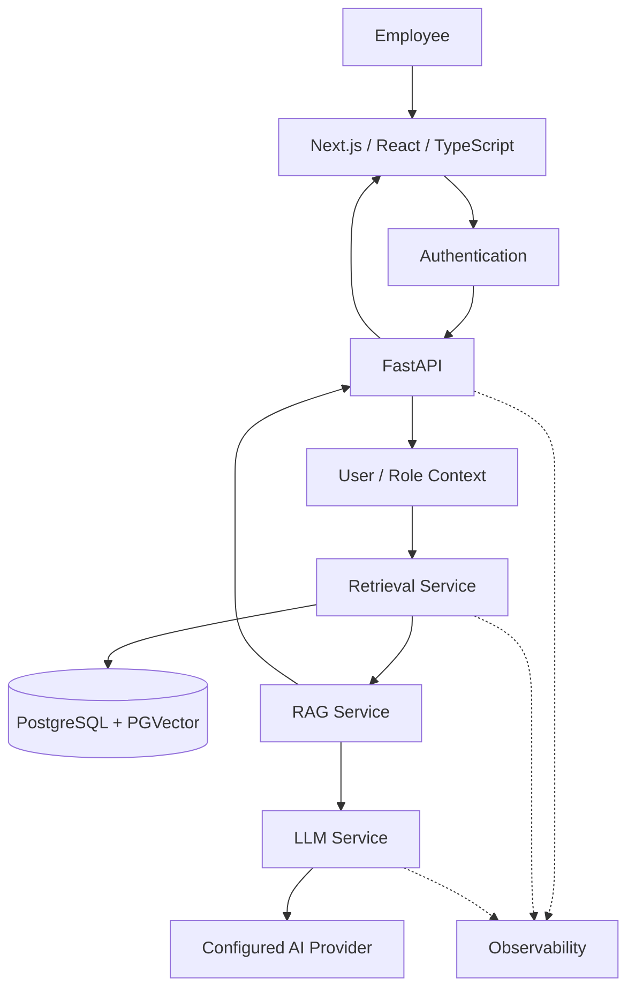

# Enterprise Knowledge Copilot — Implementation Roadmap

**Project:** Enterprise Knowledge Copilot  
**Document Type:** Engineering Implementation Roadmap  
**Status:** Approved  
**Implementation Status:** 🚧 Active Development  
**Duration:** 14-Day Intensive Build Sprint

---

# 1. Purpose

This roadmap converts the Enterprise Knowledge Copilot architecture into an executable engineering plan.

The objective is not simply to finish an application quickly.

The objective is to build a portfolio project that demonstrates the ability to:

- understand the business problem;
- design an appropriate architecture;
- implement production-minded software;
- build and evaluate RAG;
- secure organisational knowledge;
- create a full-stack application;
- test failure scenarios;
- containerise the system;
- automate quality checks;
- observe application behaviour;
- deploy the product;
- explain every major engineering decision.

The project follows:

> **Learn → Build → Break → Test → Defend → Document → Ship**

A milestone is not complete merely because the code runs.

---

# 2. Product Goal

Build a secure full-stack Generative AI platform that helps authorised employees find reliable answers from organisational documents.

The application should eventually provide:

```text
Organisational Documents
        ↓
Ingestion
        ↓
Chunking
        ↓
Metadata
        ↓
Embeddings
        ↓
PostgreSQL + PGVector
        ↓
Permission-Aware Retrieval
        ↓
RAG
        ↓
LLM
        ↓
Grounded Answer
        ↓
Source Citations
```

Employee experience:

```text
FIND → ASK → VERIFY
```

---

# 3. Target Architecture



---

# 4. Current Starting Point

Before the 14-day implementation sprint, the project has already established foundational learning and prototype work.

## Implemented / Demonstrated

```text
GitHub repository
Python project
uv dependency management
FastAPI foundation
Pydantic request validation
Health endpoint
Question endpoint foundation
Environment-based secret configuration
Gemini connectivity
LLM service abstraction
Embedding generation experiment
Cosine similarity implementation
Top-K retrieval experiment
Initial grounded-generation experiment
Initial retrieval-service refactoring
```

---

## Not Yet Enterprise-Ready

The project still needs:

```text
Real document ingestion
Persistent PostgreSQL storage
PGVector retrieval
Metadata
Document lifecycle
Production RAG orchestration
Source citations
Insufficient-evidence handling
Authentication
RBAC
Permission-aware retrieval
Evaluation benchmark
Next.js frontend
Docker
CI/CD
Observability
Deployment
Automated testing
```

The project must not describe these as implemented until they have been built and verified.

---

# 5. Sprint Completion Rule

Every day follows:

```text
LEARN
  ↓
BUILD
  ↓
RUN
  ↓
BREAK
  ↓
DEBUG
  ↓
TEST
  ↓
DEFEND
  ↓
DOCUMENT
  ↓
COMMIT
```

A day is complete only when the important concepts can be explained.

---

# 6. Competency Status

At the end of each milestone, understanding should be classified as:

```text
PASS
```

or:

```text
NEEDS WORK
```

A PASS requires the ability to explain:

```text
What did we build?

Why do we need it?

How does it work?

What could fail?

How did we test it?

What alternative could we have used?

Why did we make this engineering decision?
```

---

# 7. Day 1 — Retrieval Engine

## Objective

Complete the retrieval foundation.

## Learn

Understand:

```text
Embeddings
Vector Similarity
Cosine Similarity
Semantic Search
Ranking
Top-K
Retrieval
```

## Build

Complete:

```text
RetrievalService
```

Flow:

```text
Question
   ↓
Question Embedding
   ↓
Compare with Document Embeddings
   ↓
Similarity
   ↓
Ranking
   ↓
Top-K
```

## Test

Test:

```text
Known semantic question
Unrelated question
Ranking behaviour
Top-K behaviour
Empty candidates
```

## Break

Deliberately test cases where the nearest available document is still irrelevant.

Understand:

> **Best available does not necessarily mean relevant enough.**

## GitHub Evidence

```text
retrieval_service.py
retrieval tests
documentation updates
meaningful commit
```

## Defence

Explain:

- embeddings;
- cosine similarity;
- semantic retrieval;
- Top-K;
- why similarity is not confidence;
- why there is no universal relevance threshold.

---

# 8. Day 2 — Document Ingestion

## Objective

Replace hard-coded policy strings with a real ingestion pipeline.

## Learn

Understand:

```text
Document Loading
Text Extraction
Chunking
Chunk Size
Overlap
Metadata
Document Identity
```

## Build

Target flow:

```text
Document
   ↓
Validation
   ↓
Text Extraction
   ↓
Chunking
   ↓
Metadata
   ↓
Embedding
```

Start with a controlled synthetic policy document format.

## Metadata

Each chunk should eventually know information such as:

```text
document_id
title
section
page where available
version
department
status
access scope
```

## Test

Verify:

```text
document loads
text extracts
chunks created
metadata preserved
empty/invalid input handled
```

## Break

Try:

```text
empty document
malformed document
unsupported format
very short document
large section
```

## Defence

Explain why:

```text
too-small chunks
```

lose context and:

```text
too-large chunks
```

can reduce retrieval precision and increase unnecessary context.

---

# 9. Day 3 — PostgreSQL + PGVector

## Objective

Replace in-memory embeddings with persistent vector storage.

## Learn

Understand:

```text
Relational Database
Table
Row
Primary Key
Foreign Key
Vector Column
Persistent Storage
Vector Search
```

## Build

Introduce:

```text
PostgreSQL
+
PGVector
```

Store:

```text
Documents
Document Versions
Chunks
Embeddings
Metadata
```

## Retrieval

Move from:

```text
Python list
```

to:

```text
Database-backed semantic retrieval
```

## Test

Verify:

```text
document persists
chunk persists
embedding persists
vector query executes
metadata returns correctly
```

## Break

Test:

```text
database unavailable
missing record
invalid document relationship
```

## Defence

Explain why PostgreSQL + PGVector was selected instead of adding several vector databases.

---

# 10. Day 4 — Production RAG Pipeline

## Objective

Connect retrieval and generation into the core application service.

## Build

Target:

```text
Question
   ↓
Embedding
   ↓
Retrieval
   ↓
Evidence Assessment
   ↓
Prompt Construction
   ↓
LLM
   ↓
Grounded Answer
   ↓
Citations
```

Create clear service boundaries such as:

```text
RetrievalService
RAGService
LLMService
```

## Insufficient Evidence

Implement explicit behaviour for questions unsupported by the available organisational knowledge.

## Citations

Answers should return citations from trusted application metadata rather than asking the model to invent references.

## Test

Evaluate:

```text
supported question
unsupported question
multiple sources
irrelevant retrieval
```

## Defence

Explain:

- what RAG solves;
- why retrieved evidence is passed to the LLM;
- why citations should originate from trusted metadata;
- why abstention matters.

---

# 11. Day 5 — Backend API Architecture

## Objective

Turn the prototype API into a structured application boundary.

## Learn

Understand:

```text
HTTP
REST
Request
Response
Status Codes
Validation
Service Layer
Dependency Failure
```

## Build

Target API direction:

```text
/api/v1/questions
/api/v1/documents
/health
/readiness
```

Implement structured request and response models.

## Error Behaviour

Differentiate:

```text
Validation Error
Authentication Error
Authorisation Error
Insufficient Evidence
Database Failure
LLM Failure
```

## Test

API tests should verify:

```text
valid request
invalid request
missing field
unsupported question
dependency failure
```

## Defence

Explain why the endpoint should orchestrate application services rather than contain all business logic.

---

# 12. Day 6 — RAG Evaluation

## Objective

Stop judging the system by whether several demonstrations "look good."

Create measurable evaluation.

## Build

Create a versioned evaluation dataset containing:

```text
Question
Expected Source
Expected Evidence
Allowed Documents
Expected Outcome
```

Categories:

```text
Supported
Unsupported
Conflicting
Outdated
Restricted
Retrieval Edge Cases
Adversarial
```

## Retrieval Metrics

Measure where appropriate:

```text
Recall@K
Precision@K
MRR
```

## Generation Evaluation

Evaluate:

```text
Groundedness
Citation Correctness
Answer Correctness
Abstention Behaviour
```

## Security Evaluation

Measure whether restricted evidence appears where it should not.

## Rule

Never invent evaluation results.

Only report metrics produced by actual experiments.

## Defence

Explain the difference between:

```text
retrieval failure
```

and:

```text
generation failure
```

---

# 13. Day 7 — Next.js Frontend

## Objective

Build the employee-facing knowledge workspace.

## Learn

Understand:

```text
React Components
Props
State
TypeScript
API Calls
Loading State
Error State
```

## Build

Implement the approved:

```text
Find → Ask → Verify
```

experience.

Core components:

```text
Header
SourcesPanel
QuestionInput
AssistantAnswer
CitationList
SourceViewer
```

## UX

Keep the interface intentionally simple.

Do not build a large enterprise dashboard.

## Test

Verify:

```text
question input
loading state
answer rendering
citation rendering
error state
insufficient-evidence state
```

## Defence

Explain why technical RAG configuration is hidden from normal employees.

---

# 14. Day 8 — Full-Stack Integration

## Objective

Connect the Next.js application to FastAPI.

Target:

```text
Browser
   ↓
Next.js
   ↓
FastAPI
   ↓
RAG
   ↓
PostgreSQL / PGVector
   ↓
LLM
   ↓
Answer + Sources
   ↓
Next.js
```

## Build

Implement:

```text
API client
typed responses
loading behaviour
error handling
citation display
source inspection
```

## Test

Verify the full journey.

## Break

Test:

```text
backend unavailable
invalid response
slow request
insufficient evidence
provider failure
```

## Defence

Explain the frontend/backend contract and why the frontend should not directly call private AI services.

---

# 15. Day 9 — Authentication & Permission-Aware Retrieval

## Objective

Implement the project's most important enterprise security boundary.

## Learn

Understand:

```text
Authentication
Authorisation
Role
Permission
RBAC
Least Privilege
```

## Build

Target:

```text
User
 ↓
Authentication
 ↓
Identity
 ↓
Roles / Permissions
 ↓
Authorised Document Scope
 ↓
Retrieval
 ↓
LLM
```

Critical rule:

> **Restricted chunks must be removed before retrieval results are supplied to the LLM.**

## Test

Create users such as:

```text
Employee
HR
Finance
Administrator
```

and verify different document access.

## Security Test

```text
Employee
   ↓
Finance-related question
   ↓
Restricted Finance Chunk
   ↓
MUST NOT ENTER LLM CONTEXT
```

## Defence

Explain why filtering after generation is not sufficient security.

---

# 16. Day 10 — Docker & Runtime Packaging

## Objective

Make the application reproducible outside the development environment.

## Learn

Understand:

```text
Image
Container
Dockerfile
Port
Volume
Environment Variable
Container Network
Docker Compose
```

## Build

Containerise:

```text
FastAPI
Next.js
PostgreSQL + PGVector
```

Use Docker Compose for local orchestration.

## Test

Verify:

```text
fresh build
containers start
frontend reaches backend
backend reaches database
database persists
```

## Break

Test:

```text
missing environment variable
database unavailable
container restart
```

## Defence

Explain the difference between:

```text
Docker Image
```

and:

```text
Docker Container
```

and why `localhost` changes meaning across containers.

---

# 17. Day 11 — Automated Testing & CI/CD

## Objective

Prevent unverified changes from silently breaking the application.

## Build

Introduce automated:

```text
Unit Tests
API Tests
Retrieval Tests
Integration Tests
Security Tests
```

Use:

```text
pytest
```

for backend testing where appropriate.

## CI

Create GitHub Actions workflow:

```text
Push / Pull Request
        ↓
Install
        ↓
Checks
        ↓
Tests
        ↓
Build
        ↓
Pass / Fail
```

## Critical CI Test

Permission leakage should fail the pipeline.

## Defence

Explain:

- unit vs integration testing;
- deterministic vs probabilistic tests;
- mocks;
- why RAG evaluation is not identical to software testing.

---

# 18. Day 12 — Observability & Failure Engineering

## Objective

Make system behaviour diagnosable.

## Build

Introduce:

```text
Structured Logs
Request IDs
Latency Measurement
Error Categories
Retrieval Events
LLM Events
```

Trace concept:

```text
Request
   ↓
Authentication
   ↓
Retrieval
   ↓
Database
   ↓
LLM
   ↓
Response
```

## Failure Engineering

Deliberately test:

```text
LLM failure
Database failure
Embedding failure
Invalid request
Insufficient evidence
Unauthorised retrieval
```

## Security

Do not log:

```text
API keys
tokens
passwords
restricted document text
```

## Defence

Answer:

> A user received a wrong answer. How would you determine what went wrong?

using the request trace.

---

# 19. Day 13 — Deployment

## Objective

Make the application usable outside the development machine.

## Strategy

Use a:

```text
Free-First Deployment
```

while preserving architectural portability.

## Deploy

Target:

```text
Frontend
Backend
PostgreSQL + PGVector
```

using currently suitable free-tier services where feasible.

Hosting providers must be verified at deployment time because free-tier conditions can change.

## Configure

Use deployment secrets for:

```text
AI Provider Key
Database Credentials
Authentication Secrets
```

## Verify

Run:

```text
Health Check
Readiness Check
API Smoke Test
Frontend Smoke Test
RAG Smoke Test
```

## Measure

Record actual:

```text
latency
limitations
cold-start behaviour
resource constraints
```

where observed.

## Defence

Explain how the same application could move from portfolio infrastructure to a larger cloud environment.

---

# 20. Day 14 — Portfolio Release & Project Defence

## Objective

Convert the completed engineering work into credible evidence.

## Repository Audit

Verify:

```text
README
Architecture
Documentation
Tests
CI/CD
Docker
Evaluation
Deployment
Screenshots
Commit History
```

## README Update

Replace planned statuses with actual verified implementation results.

Do not claim anything that cannot be demonstrated.

## Architecture Update

Document:

```text
Target Architecture
vs
Actually Implemented Architecture
```

## Evaluation Results

Publish actual measured results.

Examples:

```text
Recall@K
Precision@K
MRR
Citation Accuracy
Abstention Behaviour
Latency
```

only where genuinely measured.

## Screenshots

Capture:

```text
Main Workspace
Grounded Answer
Source Citation
Insufficient Evidence
Permission Behaviour where appropriate
CI Pipeline
```

## Demo

Prepare a short demonstration:

```text
Problem
  ↓
Architecture
  ↓
Question
  ↓
Retrieval
  ↓
Answer
  ↓
Citation
  ↓
Security
  ↓
Evaluation
```

---

# 21. Final Project Defence

The project owner should be able to explain:

### Business

```text
What problem does the product solve?
```

### Architecture

```text
Why this architecture?
```

### API

```text
How does the frontend communicate with the backend?
```

### RAG

```text
How does retrieval work?
```

### Embeddings

```text
Why are embeddings needed?
```

### Database

```text
Why PostgreSQL + PGVector?
```

### Security

```text
How do you prevent restricted information entering LLM context?
```

### Evaluation

```text
How do you know retrieval is working?
```

### Testing

```text
What happens when dependencies fail?
```

### Deployment

```text
How does the system move from source code to production?
```

### Trade-Offs

```text
Why did you not use every technology mentioned in the job description?
```

---

# 22. 14-Day Milestone Summary

| Day | Milestone | Primary Deliverable |
|---|---|---|
| 1 | Retrieval Engine | Tested retrieval service |
| 2 | Document Ingestion | Chunking + metadata pipeline |
| 3 | Vector Database | PostgreSQL + PGVector |
| 4 | Production RAG | Grounded answers + citations |
| 5 | Backend API | Structured FastAPI application |
| 6 | Evaluation | Measured RAG benchmark |
| 7 | Frontend | Next.js knowledge workspace |
| 8 | Full-Stack | Frontend/backend integration |
| 9 | Enterprise Security | Authentication + permission-aware retrieval |
| 10 | Docker | Containerised application |
| 11 | Testing & CI/CD | Automated tests + GitHub Actions |
| 12 | Observability | Logs, traces and failure diagnosis |
| 13 | Deployment | Working portfolio deployment |
| 14 | Portfolio Release | Evidence + project defence |

---

# 23. Technology Coverage

By completing the roadmap, the project should provide practical experience with:

```text
Python
FastAPI
Pydantic
HTTP APIs
LLMs
Embeddings
RAG
Semantic Retrieval
PostgreSQL
PGVector
Authentication
RBAC
Next.js
React
TypeScript
Docker
Docker Compose
GitHub
GitHub Actions
Testing
Evaluation
Observability
Deployment
```

Additional technologies should only be introduced when justified.

---

# 24. Conditional Technologies

The following are not required merely to complete the core project:

```text
LangChain
LangGraph
CrewAI
Qdrant
MongoDB
Terraform
Kubernetes
Multi-Agent Architecture
```

They may be introduced later if an engineering requirement demonstrates their value.

---

# 25. Enterprise Readiness Gate

The project should not be called enterprise-ready simply because all 14 days have elapsed.

Enterprise readiness requires evidence.

The release gate asks:

```text
Does authentication work?

Does authorisation work?

Are permissions enforced before retrieval?

Is organisational knowledge persistent?

Are answers grounded?

Are citations traceable?

Does unsupported knowledge cause abstention?

Are security scenarios tested?

Are important failures controlled?

Are tests automated?

Is behaviour observable?

Can the application be deployed reproducibly?

Can the architecture be defended?
```

If important answers are:

```text
NO
```

the relevant milestone remains incomplete.

---

# 26. GitHub Evidence Standard

Each major milestone should leave visible evidence.

Examples:

```text
Source Code
Tests
Documentation
Commit
Evaluation Result
Architecture Update
CI Result
Screenshot
```

The repository should show engineering progression rather than only the final code dump.

---

# 27. Commit Discipline

Commits should describe meaningful changes.

Examples:

```text
feat: implement document ingestion pipeline

feat: add pgvector semantic retrieval

feat: implement grounded RAG responses

test: add permission-aware retrieval tests

feat: add request correlation and structured logging

ci: add backend test workflow

docs: publish RAG evaluation results
```

Avoid meaningless commit histories such as:

```text
update
fix
again
final
final2
```

where practical.

---

# 28. Daily Progress Record

At the end of each day record:

```text
Day:
Milestone:

What I learned:

What I built:

What I tested:

What failed:

How I fixed it:

What I can now explain:

Git commit:

Competency:
PASS / NEEDS WORK
```

This creates evidence of engineering learning.

---

# 29. Senior Interview Preparation

Completing the application is not the end of the programme.

After the portfolio release, preparation moves to senior-role interview defence.

Areas include:

```text
Project Deep Dive
Python
FastAPI
API Design
LLM Engineering
RAG
Retrieval Failures
Vector Databases
Evaluation
Security
Full-Stack Architecture
Docker
CI/CD
Cloud
Observability
System Design
Trade-Off Analysis
Agentic AI
Kubernetes Fundamentals
Terraform Fundamentals
```

The objective is not to claim production experience that has not occurred.

The objective is to demonstrate strong engineering understanding through a project that can be defended technically.

---

# 30. Interview Progression

Interview preparation should progress through:

```text
Explain
   ↓
Compare
   ↓
Debug
   ↓
Design
   ↓
Defend
   ↓
Trade-Off
```

Example progression:

```text
What is RAG?

Why does this application need RAG?

What can cause retrieval failure?

How would you measure retrieval?

Your Recall@K dropped after changing chunk size.
How would you investigate?

When would you add reranking?

When would you replace PGVector?
```

---

# 31. Project Completion Standard

The project is complete when we can demonstrate:

```text
BUSINESS PROBLEM
        ↓
ARCHITECTURE
        ↓
WORKING APPLICATION
        ↓
SECURE RETRIEVAL
        ↓
MEASURED RAG
        ↓
TESTING
        ↓
CI/CD
        ↓
OBSERVABILITY
        ↓
DEPLOYMENT
        ↓
DOCUMENTED EVIDENCE
        ↓
TECHNICAL DEFENCE
```

---

# 32. Final Engineering Principle

The project should never optimise for:

```text
Number of Technologies
```

It should optimise for:

```text
Depth of Understanding
+
Quality of Engineering
+
Evidence
+
Ability to Defend Decisions
```

The governing rule for the entire roadmap is:

> **Do not build what you cannot explain. Do not claim what you have not measured. Do not add complexity without a requirement.**
