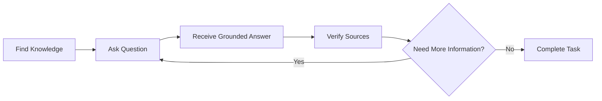
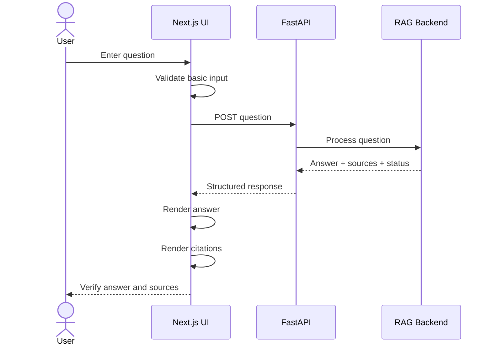

# UI/UX Design Specification

**Project:** Enterprise Knowledge Copilot  
**Document Type:** Product UI/UX Specification  
**Status:** Approved Target Design  
**Implementation Status:** 📋 Planned  
**Frontend Direction:** Next.js + React + TypeScript

---

# 1. Purpose

This document defines the target user experience for Enterprise Knowledge Copilot.

The application contains significant technical complexity:

- authentication;
- permission-aware retrieval;
- embeddings;
- vector search;
- RAG;
- source citations;
- document lifecycle management;
- evaluation;
- observability.

Employees should not need to understand that complexity to use the product.

The central UX principle is:

> **Find → Ask → Verify**

The interface should make organisational knowledge easier to access while making the evidence behind AI-generated answers easy to inspect.

---

# 2. Product Experience

The employee experience should answer three questions:

```text
FIND
What organisational knowledge is available to me?

ASK
What do I need to know?

VERIFY
What source supports the answer?
```

This creates the primary interaction:



---

# 3. Design Philosophy

The interface should be:

- simple;
- focused;
- trustworthy;
- readable;
- responsive;
- accessible;
- source-oriented.

It should avoid unnecessary:

- dashboards;
- charts;
- navigation layers;
- AI controls;
- configuration panels;
- technical terminology.

The application should feel simple even when the underlying engineering is sophisticated.

---

# 4. Inspiration

The knowledge-workflow philosophy is inspired by products that place sources and AI-assisted questioning in the same workspace.

The project may use a NotebookLM-like interaction principle:

```text
Sources
   +
Question Workspace
   +
Evidence
```

However, Enterprise Knowledge Copilot should have its own:

- visual identity;
- component design;
- information architecture;
- implementation;
- enterprise workflows.

The objective is inspiration from interaction simplicity, not visual duplication.

---

# 5. Primary User

The primary employee user wants to answer questions such as:

```text
Can I work remotely?

How much annual leave do I receive?

What is the password policy?

Which security procedure applies to me?
```

The employee should not need to know:

```text
RAG
Embeddings
PGVector
Top-K
Cosine Similarity
Prompt Engineering
```

Those are implementation details.

---

# 6. Secondary Users

The wider product may eventually support:

### Knowledge Owners

Responsible for:

- adding documents;
- updating documents;
- reviewing lifecycle status;
- managing knowledge metadata.

### Administrators

Responsible for:

- permissions;
- user access;
- system administration.

### Engineers

Responsible for:

- evaluation;
- debugging;
- monitoring;
- deployment.

These experiences should not clutter the primary employee interface.

---

# 7. Primary Workspace

The main interface should resemble:

```text
┌──────────────────────────────────────────────────────────────┐
│ Company Logo       Enterprise Knowledge Copilot        User │
├───────────────────┬──────────────────────────────────────────┤
│                   │                                          │
│ SOURCES           │ Ask your company                        │
│                   │                                          │
│ Remote Working    │ ┌────────────────────────────────────┐  │
│ Annual Leave      │ │ Can I work from home?             │  │
│ IT Security       │ └────────────────────────────────────┘  │
│                   │                                          │
│                   │ Employees may work remotely for up      │
│                   │ to two days per week, subject to        │
│                   │ approval from their line manager.       │
│                   │                                          │
│                   │ Sources                                  │
│                   │ ┌────────────────────────────────────┐  │
│                   │ │ Remote Working Policy             │  │
│                   │ │ Section 3.1                       │  │
│                   │ └────────────────────────────────────┘  │
│                   │                                          │
│                   │ ┌────────────────────────────────────┐  │
│                   │ │ Ask another question...           │  │
│                   │ └────────────────────────────────────┘  │
└───────────────────┴──────────────────────────────────────────┘
```

This is a conceptual layout rather than the final visual implementation.

---

# 8. Information Architecture

The employee interface should initially contain three major regions.

```text
Header
   ↓
Knowledge Workspace
   ├── Sources
   └── Question / Answer Area
```

The product should avoid creating navigation pages without a real user requirement.

---

# 9. Header

The header may contain:

```text
Organisation Identity
Product Name
User Menu
```

Potential user-menu actions:

```text
Account
Sign Out
```

Administrative controls should only appear for authorised users.

---

# 10. Sources Panel

The source panel helps users understand which organisational knowledge is available.

Example:

```text
Sources

📄 Remote Working Policy
📄 Annual Leave Policy
📄 IT Security Policy
```

The panel should not display documents the authenticated user is not authorised to discover.

Frontend filtering alone is not sufficient.

The backend remains responsible for enforcing access control.

---

# 11. Source Selection

Selecting a source may allow the user to inspect:

```text
Document Title
Version
Section
Relevant Extract
Lifecycle Status where useful
```

The source view should help users verify an answer without overwhelming them with database metadata.

---

# 12. Question Input

The primary action should be immediately obvious.

Example:

```text
Ask your company

┌───────────────────────────────────────────────┐
│ Ask a question about company knowledge...   │
└───────────────────────────────────────────────┘
```

The application should not require the employee to:

- choose an embedding model;
- choose Top-K;
- select an LLM;
- configure temperature;
- understand retrieval settings.

Those belong to engineering configuration.

---

# 13. Example Questions

When the workspace is empty, optional example questions may help users understand the product.

Examples:

```text
Can I work remotely?

How many days of annual leave do I receive?

What are the password requirements?
```

Examples must correspond to the synthetic knowledge base used by the portfolio project.

---

# 14. Answer Presentation

A generated response should prioritise:

```text
Answer
   ↓
Supporting Sources
```

Example:

```text
Employees may work remotely for up to two days per week,
subject to approval from their line manager.

Sources

Remote Working Policy
Section 3.1
```

The source should be visually connected to the claim it supports.

---

# 15. Citation Interaction

A citation should be interactive where practical.

Example:

```text
[Remote Working Policy · §3.1]
```

Selecting it may open:

```text
┌──────────────────────────────────────┐
│ Remote Working Policy               │
│ Version 2.0                         │
│ Section 3.1                         │
│                                     │
│ Employees may work remotely for... │
└──────────────────────────────────────┘
```

The exact interaction will be determined during frontend implementation.

---

# 16. Source Verification

The user should be able to distinguish:

```text
AI-generated explanation
```

from:

```text
Organisational source evidence
```

This supports the product principle:

> **Trust through verification rather than trust through confident language.**

---

# 17. Insufficient Evidence

When the system cannot find enough organisational evidence, the UI should communicate that clearly.

Example:

```text
I cannot find this information in the available company policies.
```

The UI should not make this look like a technical crash.

This is a valid RAG outcome.

---

# 18. Insufficient Evidence UX

Conceptually:

```text
Question
"What is our company car allowance?"

        ↓

No sufficient evidence

        ↓

┌──────────────────────────────────────────┐
│ I cannot find this information in the  │
│ available company policies.            │
│                                        │
│ No supporting source was found.        │
└──────────────────────────────────────────┘
```

No fabricated citation should be displayed.

---

# 19. Loading State

LLM responses may take noticeable time.

The interface should provide feedback.

Example:

```text
Searching company knowledge...
```

followed by:

```text
Preparing answer...
```

if the implementation can truthfully represent these stages.

Avoid fake progress percentages.

---

# 20. Error State

Infrastructure failure must look different from insufficient evidence.

Example:

```text
We couldn't complete your request because the service
is temporarily unavailable.

Please try again.
```

The user should not see:

```text
Python stack trace
Database exception
Provider SDK exception
API credentials
```

---

# 21. Access Denied State

When appropriate:

```text
You do not have permission to access this resource.
```

The interface should not expose confidential metadata unnecessarily.

For example, revealing the exact title of a highly restricted document may itself disclose information.

---

# 22. Empty State

Before the user asks anything:

```text
Ask your company

Find answers grounded in the organisational
knowledge available to you.

[ Ask a question... ]
```

Optional example prompts may appear underneath.

---

# 23. Conversation Experience

The initial experience can support a simple conversational flow:

```text
Question
Answer + Sources

Question
Answer + Sources

Question
Answer + Sources
```

Conversation memory should not be introduced until its behaviour and security implications are explicitly implemented.

---

# 24. Conversation Context

If conversation memory is later supported, the user should understand whether follow-up questions use previous context.

Example:

```text
User:
Can I work remotely?

Assistant:
Up to two days per week...

User:
Does my manager need to approve it?
```

The application must determine whether the second request includes conversation context deliberately rather than accidentally.

---

# 25. Knowledge Owner Experience

Knowledge owners may eventually need a separate management area.

Potential functions:

```text
Upload Document
View Processing Status
View Current Version
Upload New Version
Archive Document
Manage Metadata
```

This should remain separate from the normal employee question experience.

---

# 26. Document Upload UI

Conceptually:

```text
Add Knowledge

Document
[ Choose File ]

Title
[ Remote Working Policy ]

Department
[ HR ]

Access
[ Employee ]

[ Upload ]
```

Fields will follow the implemented data model.

---

# 27. Processing State

Document ingestion may have states such as:

```text
Uploading
Processing
Ready
Failed
```

The interface should not mark a document as searchable before ingestion has completed successfully.

---

# 28. Administrative Experience

Administrative functions may eventually include:

```text
Users
Roles
Document Permissions
Knowledge Lifecycle
Audit Information
```

These should not appear in the standard employee workspace unless required.

---

# 29. Engineering and Evaluation UI

Evaluation and observability are primarily engineering concerns.

The first implementation does not require a large evaluation dashboard.

Results can initially be produced through:

```text
Evaluation Scripts
Structured Results
Repository Reports
```

A dashboard should only be built if it improves an actual workflow.

---

# 30. Responsive Design

The application should support common desktop and mobile layouts.

Desktop:

```text
Sources | Question Workspace
```

Mobile:

```text
Question Workspace
        ↓
Sources available through drawer/panel
```

The core question-and-answer workflow should remain usable on smaller screens.

---

# 31. Accessibility

The UI should follow basic accessibility principles.

This includes:

- semantic HTML;
- keyboard navigation;
- visible focus states;
- form labels;
- sufficient contrast;
- meaningful button text;
- accessible error messages;
- screen-reader-friendly structure.

Icons should not be the only method of communicating important information.

---

# 32. Keyboard Interaction

Core functionality should not require a mouse.

Examples:

```text
Tab → navigate controls

Enter → submit where appropriate

Escape → close source panel/modal where appropriate
```

Exact behaviour should follow standard web conventions.

---

# 33. Visual Hierarchy

The visual hierarchy should prioritise:

```text
1. Question
2. Answer
3. Evidence
4. Secondary controls
```

Engineering details should not compete visually with the user's primary task.

---

# 34. Typography

Typography should favour readability.

The interface should use a small, consistent type scale for:

```text
Page Title
Section Heading
Body Text
Source Metadata
Secondary Information
```

Avoid excessive font sizes, weights, and decorative typography.

---

# 35. Colour

Colour should support meaning rather than decoration.

Potential semantic uses include:

```text
Success
Warning
Error
Selected Source
Focus
```

The final palette should maintain appropriate accessibility contrast.

The interface should not depend solely on colour to communicate status.

---

# 36. Component Architecture

Target frontend component direction:

```text
AppShell
│
├── Header
│
├── SourcesPanel
│   ├── SourceList
│   └── SourceItem
│
├── KnowledgeWorkspace
│   ├── EmptyState
│   ├── MessageList
│   ├── UserMessage
│   ├── AssistantAnswer
│   ├── CitationList
│   ├── CitationCard
│   └── QuestionInput
│
└── SourceViewer
```

Components should be introduced when implementation requires them rather than creating empty abstractions.

---

# 37. Frontend Data Flow



---

# 38. Target Frontend Response Contract

The frontend should receive a predictable structure.

Conceptually:

```json
{
  "answer": "Employees may work remotely for up to two days per week.",
  "status": "answered",
  "sources": [
    {
      "title": "Remote Working Policy",
      "section": "3.1",
      "page": 4,
      "version": "2.0"
    }
  ]
}
```

The UI should not need to understand the internal vector-search implementation.

---

# 39. UI State Model

The question experience should explicitly represent states.

```text
idle
  ↓
submitting
  ↓
success
```

or:

```text
submitting
  ↓
insufficient_evidence
```

or:

```text
submitting
  ↓
error
```

Explicit state handling prevents confusing interfaces.

---

# 40. Feedback UX

A future answer may include lightweight feedback controls.

Example:

```text
Was this helpful?

👍  👎
```

If negative feedback is selected, an optional reason may be collected.

Feedback should remain secondary to the answer and evidence.

---

# 41. What the UI Should Not Display by Default

Normal employees do not need:

```text
Cosine Similarity: 0.81372

Embedding Model: gemini-embedding-001

Top-K: 3

Vector Dimension: ...

Temperature: ...

Prompt Tokens: ...
```

These are engineering signals.

They belong in evaluation or observability tooling, not the normal knowledge experience.

---

# 42. Confidence Presentation

The UI should avoid translating raw similarity values into misleading percentages.

For example:

```text
Confidence: 84%
```

should not be displayed merely because vector similarity was:

```text
0.84
```

Similarity is not automatically calibrated answer confidence.

Trust should primarily come from evidence and citations.

---

# 43. Security UX

The UI should respect security while remembering that security is enforced by the backend.

Conceptually:

```text
Frontend
   ↓
Display permitted resources

Backend
   ↓
Enforce permitted resources
```

If the frontend contains a bug, backend controls must still protect restricted information.

---

# 44. Privacy UX

The application should avoid encouraging users to enter unnecessary sensitive information.

Where appropriate, the interface may remind users that questions should relate to organisational knowledge and comply with company data-handling policies.

The portfolio version uses synthetic organisational data.

---

# 45. Source Freshness

Where useful, source information may show:

```text
Version
Effective Date
Status
```

Example:

```text
Remote Working Policy
Version 2.0
Current
```

This can help users understand which organisational source supports the answer.

---

# 46. Design for Failure

The interface must deliberately support:

```text
No Evidence
Access Denied
Network Failure
LLM Failure
Database Failure
Document Processing Failure
```

A production-oriented interface cannot be designed only around successful AI responses.

---

# 47. MVP Employee Experience

The first frontend release should prioritise:

```text
Header
Sources Panel
Question Input
Answer Display
Citation Display
Loading State
Insufficient-Evidence State
Error State
```

This is enough to demonstrate the core product.

---

# 48. Later Enhancements

Potential future improvements include:

```text
Conversation History
Source Search
Document Preview
Feedback
Knowledge Administration
Advanced Accessibility Review
Streaming Responses
```

These should be introduced according to product value rather than visual complexity.

---

# 49. Features Deliberately Avoided Initially

The initial employee interface does not require:

```text
Complex Analytics Dashboard
Model Selector
Prompt Editor
Vector Search Configuration
Agent Configuration
Multiple Chat Modes
Large Settings Area
Decorative AI Animations
```

These features would distract from the core user problem.

---

# 50. UX Acceptance Criteria

The initial portfolio frontend should demonstrate that:

- a user can understand the product without technical knowledge;
- a user can submit a question easily;
- loading state is visible;
- grounded answers are clearly displayed;
- citations are visible;
- sources can be inspected;
- insufficient evidence is distinguishable from technical failure;
- access errors are handled safely;
- restricted sources are not displayed;
- the interface works at common screen sizes;
- keyboard interaction works for core actions;
- the frontend communicates with FastAPI through structured contracts.

---

# 51. UX Success Test

A new employee should be able to open the application and understand:

```text
Where can I ask a question?

What answer did the system provide?

What company source supports that answer?

How can I inspect the source?
```

without needing technical training.

---

# 52. UI/UX North Star

The product experience can be summarised as:

```text
              FIND
                ↓
      Available Knowledge
                ↓
               ASK
                ↓
       Natural Question
                ↓
        Grounded Answer
                ↓
             VERIFY
                ↓
       Organisational Source
```

The final design principle is:

> **The AI should make company knowledge easier to use, while the interface makes its evidence easier to verify.**

The complexity belongs underneath the product — not in front of the employee.
